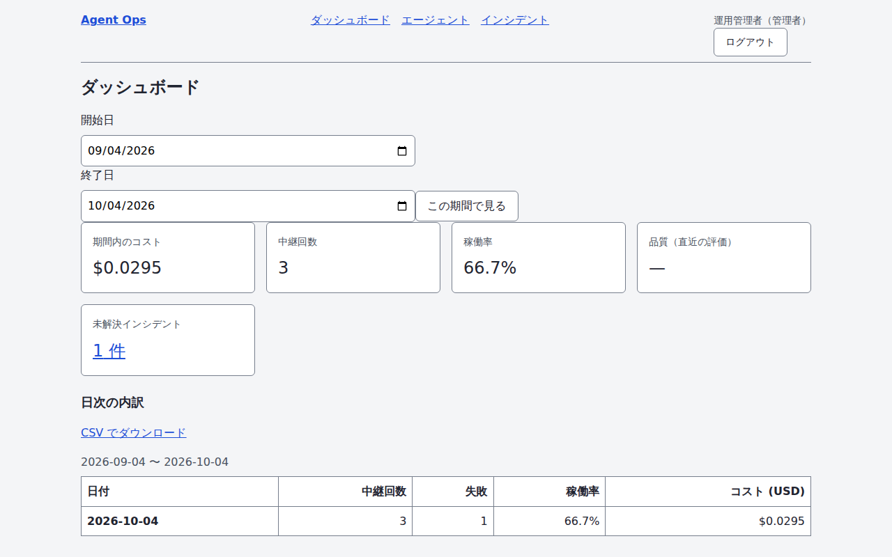
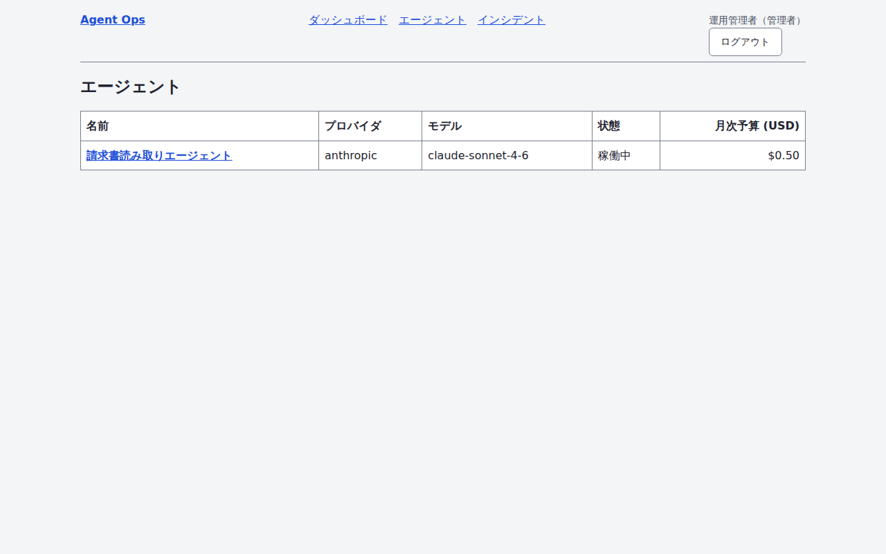
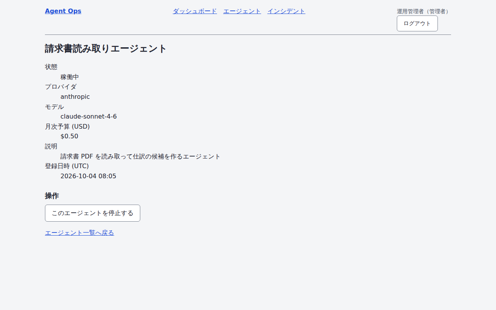
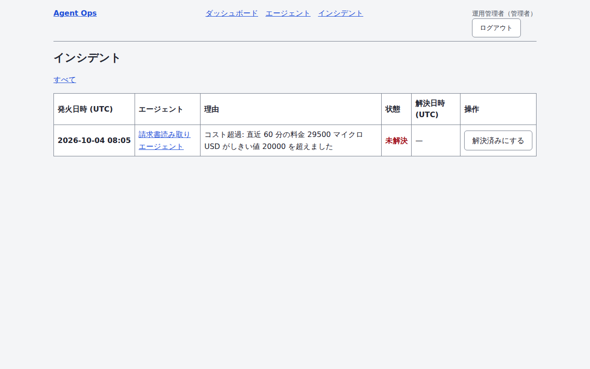
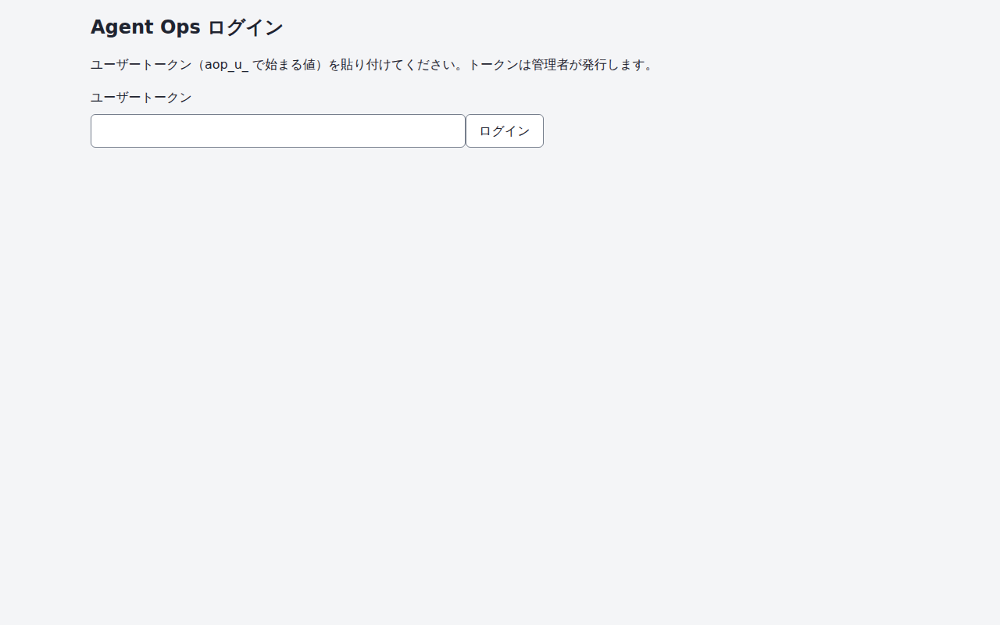

# Agent Ops

AI エージェントの**登録・権限・コスト・品質・停止**を一元管理する運用基盤（SaaS）。複数のエージェントを複数チームで運用し、コストと品質を可視化して事故（暴走・コスト超過・品質低下）を自動で止める。

- **初めて読むなら [`docs/overview.md`](./docs/overview.md)**（図つき 1 枚で全体像）
- スタック: Next.js 16（App Router）/ TypeScript / Prisma 7 / PostgreSQL 16 / Docker
- 現在の段階: **Step7（リリース準備）実装済み＝ロードマップの全 8 Step 完了**。ロードマップは [`docs/roadmap.md`](./docs/roadmap.md)、仕様は [`docs/spec.md`](./docs/spec.md)

## デモ

[▶ デモ動画を再生する](./docs/screenshots/demo.webm) — ログインしてコスト・稼働率・インシデントを見て、エージェントを止めて戻し、インシデントを解決するまでの 1 本（ダミーデータ・約 20 秒）。

| ダッシュボード | エージェント一覧 |
| --- | --- |
|  |  |

| エージェント詳細 | インシデント一覧 |
| --- | --- |
|  |  |

| ログイン |
| --- |
|  |

画像と動画は**シードデータだけ**を写しており、実在のメールアドレス・トークンは入っていない（ログインの入力欄は伏せ字）。再生成は `npm run capture:screenshots`（下記）。**公開デモ URL は提供していない**（Step7 の成果物は Vercel/Supabase 向けのデプロイ設定まで。DB と常駐サーバーが要る形態なので §15 はデモ動画で代替できる。公開する場合の手順は [`docs/deploy.md`](./docs/deploy.md)）。

## セットアップ

必要環境: Node.js 22（`.nvmrc`）・npm 10・Docker（PostgreSQL 用）。

```bash
cp .env.example .env               # DATABASE_URL / PLATFORM_ADMIN_TOKEN / AUDIT_HMAC_SECRET (いずれも 32 文字以上の乱数) を設定
docker compose up -d db            # PostgreSQL 16 を起動
npm ci                             # 依存インストール
npm run gen                        # OpenAPI → TypeScript 型を生成 (src/generated/openapi.d.ts)
npm run db:generate                # Prisma クライアントを生成 (src/generated/prisma)
npm run db:migrate                 # マイグレーション適用 (prisma migrate dev)
npm run db:seed                    # デモ用テナント / ユーザー / エージェントを投入
npm run dev                        # http://localhost:3000
```

アプリごと Docker で動かす場合: `docker compose up --build`（`app` サービスが起動時に `prisma migrate deploy` を実行する）。生存確認は `GET /api/v1/health`（DB 到達性を含む）。

### API を叩く（Step1）

認証は Bearer トークン（[ADR-0005](./docs/adr/0005-bearer-token-auth.md)）。seed 済みのユーザーには CLI でログイントークンを発行する（平文は 1 度だけ表示される）。

```bash
npx tsx scripts/issue-user-token.ts --email admin@example.com   # default-tenant の管理者にトークン発行
export TOKEN=aop_u_...                                          # 表示された平文
curl -s -H "Authorization: Bearer $TOKEN" localhost:3000/api/v1/me
curl -s -H "Authorization: Bearer $TOKEN" -H 'Content-Type: application/json' \
  -d '{"name":"要約ボット","provider":"anthropic","model":"claude-sonnet-4-6"}' localhost:3000/api/v1/agents
```

新しいテナントは `PLATFORM_ADMIN_TOKEN` で `POST /api/v1/tenants` を呼ぶと、テナント・最初の admin・その admin のトークンがまとめて返る。エンドポイント一覧は [`docs/spec.md` §4](./docs/spec.md#4-api-一覧)、定義は [`openapi/openapi.yaml`](./openapi/openapi.yaml)。

### LLM 呼び出しを中継してコストを記録する（Step2）

プロキシは**エージェントに紐づく API キー**（`aop_k_...`）でだけ呼べる（ユーザートークンでは 401。[ADR-0007](./docs/adr/0007-cost-proxy.md)）。中継先は環境変数で決まり、上流の資格情報はサーバ側だけが持つ。

```bash
# 1. エージェントに紐づく API キーを発行する (平文は発行応答でしか返らない)
curl -s -H "Authorization: Bearer $TOKEN" -H 'Content-Type: application/json' \
  -d '{"name":"本番用","agentId":"<エージェントの id>"}' localhost:3000/api/v1/api-keys
export API_KEY=aop_k_...

# 2. そのキーで中継する (.env に ANTHROPIC_API_KEY を設定しておく)
curl -s -H "Authorization: Bearer $API_KEY" -H 'Content-Type: application/json' \
  -d '{"model":"claude-sonnet-4-6","max_tokens":128,"messages":[{"role":"user","content":"こんにちは"}]}' \
  localhost:3000/api/v1/proxy/anthropic/messages

# 3. 記録されたコストを日次で見る (view 権限。日の境目は UTC)
curl -s -H "Authorization: Bearer $TOKEN" \
  'localhost:3000/api/v1/usage/daily?from=2026-09-01&to=2026-09-30'
```

料金は [`src/domain/pricing/vendor-prices.json`](./src/domain/pricing/vendor-prices.json)（出典 URL と取得日つき）の単価から整数で計算する。**表に無いモデルは中継せず 422**（計測できない呼び出しは通さない。[ADR-0008](./docs/adr/0008-usage-pricing-and-aggregation.md)）。

### 応答品質を評価する（Step3）

評価セット（固定入力）を作り、そのセットでエージェントを評価する。実行は **2 段**で、ケースごとに
(1) 対象エージェントへ入力を投げて応答を得る → (2) その応答を LLM-as-judge が採点する（[ADR-0009](./docs/adr/0009-llm-as-judge-evaluation.md)）。

```bash
# 1. 評価セットを作る (ケースは配列の順に並ぶ。実行履歴を持つセットのケースは変更できない)
curl -s -H "Authorization: Bearer $TOKEN" -H 'Content-Type: application/json' \
  -d '{"name":"基本セット","cases":[{"input":"1+1 は？","expected":"2"},{"input":"今日の天気は？"}]}' \
  localhost:3000/api/v1/evaluation-sets

# 2. そのセットで評価する (execute 権限。採点用モデルは JUDGE_PROVIDER / JUDGE_MODEL)
curl -s -H "Authorization: Bearer $TOKEN" -H 'Content-Type: application/json' \
  -d '{"agentId":"<エージェントの id>","setId":"<セットの id>"}' \
  localhost:3000/api/v1/evaluations

# 3. 実行の詳細を見る (ケース単位の採点・除外理由と、直前の実行との差が入る)
curl -s -H "Authorization: Bearer $TOKEN" localhost:3000/api/v1/evaluations/<実行の id>
```

**採点できなかったケースは理由つきで除外され、実行そのものは必ず記録に残る**（judge が落ちても 500 にしない）。
除外が半分を超えた実行は `status: "failed"`、採点できたケースが 0 件なら平均スコアは `null`（0.0 ではない）。
**評価の呼び出しは `UsageEvent` に記録しない** — 利用者の呼び出しと混ぜると日次集計と Step4 のコスト超過ルールが
評価のたびに跳ねるため。ただし**ベンダー側の課金は発生する**ので、上限（spend limit）は必ず設定しておく。

### 超過したら自動で止める・監査ログを検証する（Step4）

しきい値ルールを設定すると、**超過しうるイベントの直後**（中継・評価実行）に判定が走り、`stop` の
ルールならエージェントを `suspended` にして通知を送る（[ADR-0010](./docs/adr/0010-guardrails-and-audit-chain.md)）。
cron は要らない。

```bash
# 1. ルールを設定する (admin ロール限定。種別は cost / error_rate / quality)
#    cost のしきい値はマイクロ USD の整数、error_rate と quality は 0〜1
curl -s -H "Authorization: Bearer $TOKEN" -H 'Content-Type: application/json' \
  -d '{"agentId":"<エージェントの id>","kind":"cost","threshold":1000000,"windowMinutes":1440,"action":"stop"}' \
  localhost:3000/api/v1/guardrails

# 2. 中継を繰り返して超過させる (判定は中継の応答を返す前に終わっている)
#    超過した次の中継は 403 で断られる

# 3. 発火の記録を見る (open のものだけ絞るなら ?status=open)
curl -s -H "Authorization: Bearer $TOKEN" localhost:3000/api/v1/incidents

# 4. 原因に対処したらインシデントを解決し、別操作でエージェントを復帰させる (どちらも admin)
curl -s -X POST -H "Authorization: Bearer $TOKEN" \
  localhost:3000/api/v1/incidents/<インシデントの id>/resolve
curl -s -X POST -H "Authorization: Bearer $TOKEN" \
  localhost:3000/api/v1/agents/<エージェントの id>/resume

# 5. しきい値を誤ったルールを止める (admin 限定。発火したルールは削除できないのでこれで止める)
curl -s -X PATCH -H "Authorization: Bearer $TOKEN" -H 'Content-Type: application/json' \
  -d '{"enabled":false}' localhost:3000/api/v1/guardrails/<ルールの id>

# 6. 監査ログと、その改ざん検知 (verify は admin 限定)
curl -s -H "Authorization: Bearer $TOKEN" localhost:3000/api/v1/audit-logs
curl -s -H "Authorization: Bearer $TOKEN" localhost:3000/api/v1/audit-logs/verify
# 続きがある (reachedLimit: true) なら、返ってきた nextFromSeq を渡して次の区間を検証する
curl -s -H "Authorization: Bearer $TOKEN" \
  "localhost:3000/api/v1/audit-logs/verify?fromSeq=<nextFromSeq の値>"
```

**検証は区間に分かれる。** 1 回に読む行数には上限があるので、`reachedLimit` が `true` なら
`nextFromSeq` を `?fromSeq=` に渡して続きを検証する（渡さずに呼び直すと**同じ最古の区間を
検証し続ける**ことになり、それ以降の行は一度も確かめられない）。区間の継ぎ目も検証される。
`fromSeq` に渡せるのは 1 以上 9223372036854775807 以下（連番の列が取りうる範囲）の整数で、
範囲外・末尾を越えた値はどちらも 422 になる。

**発火したルールは削除できないので、止めるには無効化する。** 発火の記録からルールを辿れなくなると
「何がなぜ止めたのか」が読めなくなるため、`Incident` を持つルールの `DELETE` は 409 になる。しきい値を
誤った `stop` のルールは `PATCH /guardrails/{ruleId}` で `enabled: false` にして判定の対象から外す
（インシデントを解決してエージェントを復帰させれば、以降は止まらない）。切り替えられるのは `enabled`
だけで、しきい値や窓を変えたいときは作り直す（変えると過去のインシデントが「どの設定で発火したのか」を
示さなくなる）。**無効化した行はルール数の上限に数えない**（代わりに行数の天井＝有効側の 4 倍が掛かる — 不要になった行は削除する）。**上限の値は契約プランで変わる**ので、いまの値は `GET /billing` で引く（下記「プランと課金」）。

**`AUDIT_HMAC_SECRET`（32 文字以上）が必須。** 人が行う操作（停止・復帰・インシデントの解決・ルールの
登録・無効化・削除）は、鍵が無いと **503 で何も変えずに**断る（変えてから記録に失敗すると、記録の無い変更が
残り再試行も永久に失敗するため）。ガードレールの自動発火だけは例外で、記録できなくても停止は行う。

**同じ超過で記録は重ねない。** 超過は解消するまで続くので、開いているインシデントが同じルールに
あれば新しい行を作らず通知も出さない。ただし**停止はやり直す**（開いている間に復帰させられた
エージェントは再び止める）。

**通知の宛先は環境変数だけが決める**（`NOTIFY_WEBHOOK_URL` / `NOTIFY_MAIL_WEBHOOK_URL`）。利用者が
入れた URL へサーバが要求を出す形にしないため（SSRF を作らない）。`NOTIFY_SIGNING_SECRET` が無ければ
**送らない**（署名なしの通知は受け手がなりすましと区別できない）。

**上流へ費用を発生させる経路にはレート制限が掛かる**（中継 ・ 評価の実行 ・ ガードレールの明示実行。
**共有枠は契約プランごと**で、`PROXY_RATE_LIMIT_PER_MINUTE` を設定するとベンチ用にプラン差を消して
上書きできる。超過は 429 ＋ `Retry-After`）。
**1 要求の重さが違う経路には、それに加えて別の小さい枠**が掛かる（評価の実行は
`FAN_OUT_ROUTE_RATE_LIMIT_PER_MINUTE` 件、ガードレールの明示実行は
`OUTBOUND_WAIT_ROUTE_RATE_LIMIT_PER_MINUTE` 件）— 回数だけを数える 1 つの枠では、
1 要求で上流へ 400 回出る経路を守れない。数える単位は**テナント**（API キーを増やしても枠は増えない）。**`Agent.budgetMicroUsd` を設定すると、当月（UTC）の累計がそれを超えた
中継と評価の実行を 403 で断る**（上流を呼んでから断っても課金は発生するため、呼ぶ前に確かめる）。
ただし**評価の呼び出し自体は利用台帳に記録しない設計**（ADR-0009）なので、その支出は予算に積まれない
— 上限はベンダー側の月次利用上限（spend limit）で設定すること。

### 画面で運用する（Step5）

ブラウザで `http://localhost:3000` を開くとログイン画面に出る。**入力するのは Step1 と同じ
ユーザートークン**（`aop_u_...`）で、貼り付けると HttpOnly / `SameSite=Strict` の
セッション Cookie が張られる（[ADR-0011](./docs/adr/0011-dashboard-session-and-aggregation.md)）。

| 画面 | パス | できること |
| --- | --- | --- |
| ダッシュボード | `/dashboard` | 期間のコスト・中継回数・稼働率・平均品質・未解決インシデント件数と、日次の内訳。CSV ダウンロード |
| エージェント一覧 | `/agents` | 登録済みエージェントの状態・月次予算 |
| エージェント詳細 | `/agents/{agentId}` | 登録内容の確認と、**停止 / 復帰**（`stop` 権限＝admin） |
| インシデント一覧 | `/incidents` | ガードレールの発火と、**解決**（admin 限定） |

**画面のデータは API を HTTP で呼ばず、Server Component から data 層を直接読む。** 期間は
`?from=` / `?to=`（UTC の日付。既定は直近 7 日、上限は日次集計と同じ日数）。`tenantId` は
セッションの主体から取り出して必ず `where` に差し込む（クロステナント漏洩を作らない）。

**稼働率は「期間内の中継のうち `statusCode < 400` の割合」で、呼び出し 0 件の期間は `—`**（0% と
読ませない。`docs/spec.md` の UC-06 が定義の正本）。平均品質も採点 0 件なら `—`。

**日次表と CSV は同じ集計関数を通る**（`src/lib/dashboard/summary.ts`）。表示だけが合っていて
ダウンロードが違う、という食い違いを作らないため、受け入れ基準 3（突合）はこの 1 か所を見る。

**停止・復帰・解決は Server Action で、CSRF トークンと Origin の一致検査を通る**（`SameSite` は
CSRF 対策の代わりにならないので併用する。§9）。権限は API と同じ許可表（`src/domain/rbac.ts`）を
Server Action の冒頭で確かめるので、ボタンを隠すだけに頼らない。

> **前段にリバースプロキシを置くときは、ブラウザが送った `Host` をそのまま転送すること。**
> Origin の照合は `Origin` ヘッダのホストと `Host` ヘッダを突き合わせる（`X-Forwarded-Host` は
> 見ない）。nginx の `proxy_pass` は既定で `Host` を上流のアドレスに書き換えるので、
> `proxy_set_header Host $host;` を入れないと**画面の書き込み操作がすべて拒否される**
> （fail-closed なので危険ではないが、「要求を受け付けられませんでした」が出続けて原因が
> 画面からは読めない）。

### プランと課金（Step6）

契約プラン（`free` / `pro` / `enterprise`）が**上限と機能の可否**を決める。正本は
`src/domain/plan.ts` の `PLAN_LIMITS` で、値の一覧は
[`docs/spec.md` §4.1](./docs/spec.md) にある（食い違いはテストが落とす）。

```bash
# いまのプランと上限を引く (view 権限。409 / 403 を受けたときに「上限はいくつか」を知る経路)
curl -s http://localhost:3000/api/v1/billing -H "Authorization: Bearer $TOKEN" | jq
# => { "plan": "pro", "limits": { "maxAgents": 25, "proxyRateLimitPerMinute": 600,
#      "maxEnabledGuardrailRules": 50 }, "features": { "auditChainVerify": true } }
```

**上限の超過は 409、プランで使えない機能は 403**（権限不足の 403 とは文言を分ける — 同じ文言だと
利用者は役割を変えようとして直らない）。`free` では監査ログの改ざん検証（`GET /audit-logs/verify`）が
403 になる。**エラーの文言に数値は書かない**（プラン別なので書けない）ので、上限は上の API で引く。

**エージェント数とルール数の上限はデータ層が挿入と同じ原子的操作の中で数える**（API 層で
「数えてから作る」に分けると、同時に 2 本登録されたときに上限を超える）。

**プランを変えられる経路は 2 つだけ。** 課金事業者（Stripe）からの受信 Webhook と、
プラットフォーム管理者の `PATCH /tenants/{tenantId}`。**テナント内の `admin` は変えられない**
（課金の実体は事業者側にあるので、アプリ側で上げられると請求と権限が食い違う）。どちらの経路も
監査ログに `tenant.plan_changed` を残す（誰がやったかは `actorId`（Webhook 由来なら `null`）と
payload の `source` が示す）。

**事業者の顧客 ID とテナントを結び付けるのは運用者**（プラットフォーム管理者）。Webhook は顧客 ID で
テナントを**引く**だけなので、結び付けていないイベントは受け取るだけで反映されません（`applied: false`）。

**顧客を付け替えたときはサブスクリプション ID も直す。** 解約は「いまの契約の解約か」を
`billingSubscriptionId` と突き合わせて判断する（配信順が保証されないため）ので、古い ID が残っていると
以後の解約がすべて捨てられます（受信は記録済みなので再送も来ません）。新しい契約が既に有効で
`customer.subscription.created` / `.updated` が届かない場合は、下の `PATCH` で入れ直してください。

```bash
# プランと課金連携を変える (プラットフォーム管理者トークン。テナント内の admin では 403)
curl -s -X PATCH http://localhost:3000/api/v1/tenants/$TENANT_ID \
  -H "Authorization: Bearer $PLATFORM_ADMIN_TOKEN" -H 'Content-Type: application/json' \
  -d '{"plan":"pro","billingCustomerId":"cus_123"}'
# billingCustomerId / billingSubscriptionId は省けば据え置き、null を渡せば連携を外す
# (サブスクリプション ID は通常 Webhook が書くが、顧客を付け替えたときの修復に要る — 上記)
```

```bash
# 受信 Webhook (Bearer 認証は無い。署名で確かめる)
curl -s -X POST http://localhost:3000/api/v1/billing/webhook \
  -H 'Content-Type: application/json' \
  -H "Stripe-Signature: t=$(date +%s),v1=<HMAC-SHA256>" \
  -d '{"id":"evt_1","type":"customer.subscription.updated","data":{"object":{"customer":"cus_1","items":{"data":[{"price":{"lookup_key":"agent-ops-pro"}}]}}}}'
```

**`STRIPE_WEBHOOK_SECRET`（32 文字以上）が必須。** 未設定・短すぎは **503** で、署名の検証を飛ばして
受け入れることはしない（fail-closed）。署名は `` `${t}.${生の本文}` `` の HMAC-SHA256 を定数時間で
照合し、**形が違う・時刻が 5 分より古い・一致しない のどれでも同じ 401**（理由を分けると総当たりの
手がかりになる）。Stripe の SDK は入れていない（依存を増やさないため。
[ADR-0012](./docs/adr/0012-plans-and-billing.md)）。

**価格だけでなく契約の状態（`status`）も見る。** `active` / `trialing` / `past_due` は価格のプランへ反映し、
`canceled` / `unpaid` / `paused` は無料プランへ落とし、`incomplete`（支払い未完了）や知らない状態は
**何もしません**（払う前に有料の枠が付かない／解約後に届いた「価格は有料のまま」の再送で戻らない）。

**いまの契約とは別のサブスクリプションの解約は反映しません**（解約の再送が遅れているあいだに
契約を結び直した場合、古い解約で有料プランが落ちないようにするため）。

**同じイベントの 2 通目は何もせず 200**（冪等）。判定は DB の一意制約（`BillingEvent` の
`(provider, eventId)`）に任せるので、**同時に届いた 2 通でも 1 通だけが反映される**。知らない種別・
知らない顧客 ID でも「受け取った事実」は記録して 200 を返す（エラーにすると事業者の再送が延々と続く）。

**課金は受信と参照だけ。** Checkout セッションの作成（アプリから事業者へ出す経路）は同 ADR の宿題。

## 検証コマンド

```bash
npm run lint         # ESLint 9 (flat config + next/core-web-vitals)。--max-warnings=0 付き
npm run typecheck    # tsc --noEmit
npm run test         # Vitest (tests/**/*.test.ts。API テストは memory アダプタで DB 不要)
npm run test:contract # prisma アダプタの契約テスト (RUN_PRISMA_CONTRACT=1 + 専用 DB の DATABASE_URL が必要。全テーブルを TRUNCATE する)
npm run build        # 本番ビルド (standalone 出力)
npm run gate:step0   # Step0 の受け入れ基準を一括検査 (gen / db:generate / lint / format:check / typecheck / test / OpenAPI / ADR)
npm run gate:step1   # Step1 の受け入れ基準を一括検査 (上記 + テスト 60 件以上 / RBAC 3×3 の 403 / npm audit high 0)
npm run gate:step2   # Step2 の受け入れ基準を一括検査 (上記 + 料金計算が全モデル分 pass / 本番ビルド / ベンチ 2 本)
npm run gate:step3   # Step3 の受け入れ基準を一括検査 (上記 + 不正出力の除外が全理由分 pass / ベンチ 3 本)
npm run gate:step4   # Step4 の受け入れ基準を一括検査 (上記 + 発火が全種別分 pass / 改ざん検知が全種類分 pass / E2E / ベンチ 4 本)
npm run gate:step5   # Step5 の受け入れ基準を一括検査 (上記 + 突合 / 主要 5 画面の E2E / Lighthouse 2 カテゴリ ≧ 90)
npm run gate:step6   # Step6 の受け入れ基準を一括検査 (上記 + テナント越境が全パターン pass / Webhook の冪等性 / ロジック層のカバレッジ 4 指標 ≧ 80%)
npm run gate:step7   # Step7 の受け入れ基準を一括検査 (上記 + 既知バグ 0 / ベンチ 6 本。**最後の Step**)
npm run test:coverage # ロジック層のカバレッジを測る (判定はせず数値を出すだけ。合否は gate:step6 が決める)
npm run test:e2e     # 主要 5 画面の E2E (Playwright・chromium。先に npm run build。専用 DB が必要)
npm run lighthouse   # 5 画面の Lighthouse を 3 回ずつ測って中央値を出す (同上)
npm run capture:screenshots # README 用のスクショ 5 枚とデモ動画を撮り直す (同上)
npm run bench:usage  # 1 万件投入で日次集計 ≦ 1 秒 (専用 DB が必要)
npm run bench:proxy  # プロキシ経由の追加遅延 ≦ 50ms (先に npm run build。専用 DB が必要)
npm run bench:evaluation # 固定評価セット 100 件を 2 回採点して再現率 ≧ 90% (専用 DB が必要)
npm run bench:guardrail  # 発火から停止まで ≦ 3 秒 (専用 DB が必要)
npm run bench:demo-ready # 本番ビルドの起動からデモの筋が通るまで ≦ 5 分 (先に npm run build。専用 DB が必要)
npm run bench:concurrency # 同時 100 リクエストでエラー率 < 1% (同上)
```

`gate:step7`（と `gate:step2` 〜 `gate:step6`）はベンチを含むので `DATABASE_URL` に**契約テストと同じ専用 DB（名前が `_contract` で終わる）**を指定する（ベンチと E2E は全テーブルを TRUNCATE する。開発 DB を指していれば 1 件も書かずに落ちる）。ベンチはローカルに立てたスタブ上流を叩き、画面は上流を呼ばないので、**実際の Anthropic / OpenAI は呼ばず課金も発生しない**。

**E2E・Lighthouse・スクショの撮影はブラウザ（chromium）を使う。** 初回は `npx playwright install chromium` で入れる。ダウンロードできない環境では、既存の Chromium の実行ファイルを `PLAYWRIGHT_CHROMIUM_PATH` で指定する（E2E・Lighthouse・撮影の 3 つが同じ環境変数を読む）。

CI（`.github/workflows/ci.yml`）は `gate:step7` に加え、PostgreSQL サービスコンテナへのマイグレーション適用・seed の冪等性・prisma アダプタの契約テスト・本番ビルドを検証し、**`docker compose up` から 5 分以内にデモの筋が通ること**（Step7 の受け入れ基準①）を `docker-smoke` ジョブで確かめる。

## ディレクトリ

| パス | 内容 |
|---|---|
| `docs/` | 文書一式。**どの文書が何を持っているかは [`docs/index.md`](./docs/index.md) が唯一のカタログ**（初見なら [`docs/overview.md`](./docs/overview.md)、正本は `spec.md` と `roadmap.md`）。ここに一覧を写さないのは、写した側が黙って古くなるため（載せ忘れは `tests/docs-gate.test.ts` が `git ls-files` と突き合わせて落とす） |
| `vercel.json` | Vercel のビルドの結線（生成物をコミットしないのでビルド前に `gen` / `db:generate` を流す） |
| `openapi/openapi.yaml` | REST API 定義（OpenAPI 3.1、契約の正本） |
| `prisma/schema.prisma` | DB スキーマ（テナントに属する資源は `tenantId` を持つ。**例外は 2 つ**で、正本は [`docs/spec.md`](./docs/spec.md) §3） |
| `src/domain/` | フレームワーク非依存の純粋ロジック（RBAC 許可表・金額） |
| `src/data/` | Ports & Adapters（`ports/` 契約、`adapters/prisma/` 本番、`adapters/memory/` テスト） |
| `src/lib/` | 横断インフラ（Prisma 結線・定数・トークン・API 基盤 `api/`・Zod スキーマ `validations/`） |
| `src/app/api/v1/` | Route Handlers（OpenAPI 定義と 1:1） |
| `src/app/(dashboard)/` | 画面（Server Component。書き込みは `actions.ts` の Server Action） |
| `src/lib/dashboard/` | 画面・CSV・突合テストが共有する集計（`summary.ts` が唯一の集計） |
| `scripts/gate-stepN.mjs` | Step ごとのゲート（`scripts/issue-user-token.ts` は開発用トークン発行 CLI） |
| `tests/` | ユニット・API テスト（`tests/api/`）と契約テスト（`tests/data/*.contract.prisma.test.ts`） |
| `e2e/` | 主要 5 画面の Playwright テスト（`e2e/lib/` は仕込みとアプリ起動の共有部分） |

## 本番配備の前提（公開する前に必ず読む）

**手順は [`docs/deploy.md`](./docs/deploy.md)**（Vercel + Supabase）、**既知の制限の一覧は
[`docs/known-issues.md`](./docs/known-issues.md)**。以下はそのうち「公開する前に必ず読む」もので、
どちらも設計判断として ADR に記録してある。

- **上流の使いすぎは Step4 で絞ったが、ベンダー側の上限は別に要る**（ADR-0007「残る宿題」→
  [ADR-0010](./docs/adr/0010-guardrails-and-audit-chain.md)）。上流へ費用を発生させる経路（中継・評価の
  実行）にはレート制限が掛かり、`Agent.budgetMicroUsd` を設定すれば当月の累計超過で中継を断る。
  枠の値は契約プランごとだが、**レート制限はインプロセスの Map のままなので、水平スケールすると
  インスタンス数ぶん上限が緩む**（共有ストアは [ADR-0012](./docs/adr/0012-plans-and-billing.md) の宿題。
  単一インスタンス前提で運用する）。**公開前に、ベンダー側の月次利用上限（spend limit）は必ず設定すること。**
- **前段にリバースプロキシを置く前提**（ADR-0005「残る宿題」）。未対応メソッド（`TRACE` 等）の遮断、
  本文サイズとタイムアウトの上限、`/api/v1/health` と **`/api/v1/metrics`** を内部からだけ見せることは
  前段の責務にしてある。**認証経路と `POST /billing/webhook`、`GET /api/v1/metrics` のレート制限は
  前段で掛ける**（いずれもテナントが決まらないのでアプリ側の枠のキーが無い）。
  `/api/v1/metrics` は 32 文字以上のトークンで閉じてあるが、`/health` より多くの運用情報
  （どの経路が叩かれているか・どの失敗が起きているか）を返すので、網の制限も併せて掛ける。
- **運用の観測は 2 つの出口で行う**（[ADR-0014](./docs/adr/0014-observability.md)）。ログは **1 行 1 JSON** で、
  出来事は閉じた語彙（`ts` / `level` / `event` / `message` ＋ 診断）。**警報は文言ではなく `event` の等値で組む**
  （文言は推敲で変わる）。数字は `GET /api/v1/metrics`（**監視専用の読み取りトークン** `METRICS_TOKEN` のみ・Prometheus の
  テキスト形式）で、**インスタンスごとの値**なので全インスタンスをスクレイプして足し合わせる。
  耐久する事実（利用量・インシデント・監査ログ）はこの経路には出さない — `GET /usage/daily` と画面が持つ。
- **画面のセッション Cookie は本番で HTTPS 必須**（`Secure` 属性が付くので http では保持されない。
  [ADR-0011](./docs/adr/0011-dashboard-session-and-aggregation.md)）。Cookie の値はユーザートークン
  そのものなので、**失効は既存の `DELETE /users/{userId}/tokens/{tokenId}` が効く**一方、盗まれた
  ときの影響はトークン流出と同じ（不透明なセッション ID への移行は同 ADR の宿題）。
- **`AUDIT_HMAC_SECRET` を設定しないと人の操作ができない**（停止・復帰・インシデントの解決・ルールの
  登録と削除が 503）。鍵を変えるとそれ以前に書いた行は検証できなくなるので、交換した時点を運用記録に
  残すこと。`docker compose` で動かす場合は `.env` に置けば app サービスへ渡る。

## ロードマップ（要約）

| Step | 内容 | 期間 |
|---|---|---|
| 0 | 設計・骨組み（実装済み） | 1 週 |
| 1 | エージェント台帳・権限（CRUD / API キー / RBAC。実装済み） | 2 週 |
| 2 | コスト計測プロキシ（Anthropic/OpenAI 互換。実装済み） | 2 週 |
| 3 | 品質評価（LLM-as-judge。実装済み） | 2 週 |
| 4 | ガードレール・自動停止・通知・監査ログ（実装済み） | 2 週 |
| 5 | ダッシュボード（画面・CSV・Lighthouse。実装済み） | 2 週 |
| 6 | マルチテナント・課金（プラン別の上限・機能ゲート・受信 Webhook。実装済み） | 2 週 |
| 7 | リリース準備（デプロイ設定・API docs・デモシード・負荷試験レポート。実装済み・本 README の状態） | 1 週 |

各 Step の受け入れ基準は `npm run gate:stepN` で機械的に検査し、赤なら次 Step のブランチを切らない。
**全 Step 完了後も `gate:step7` が最新のゲート**で、CI は常にこれを回す。

## ライセンス

MIT
