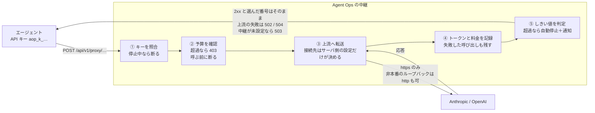
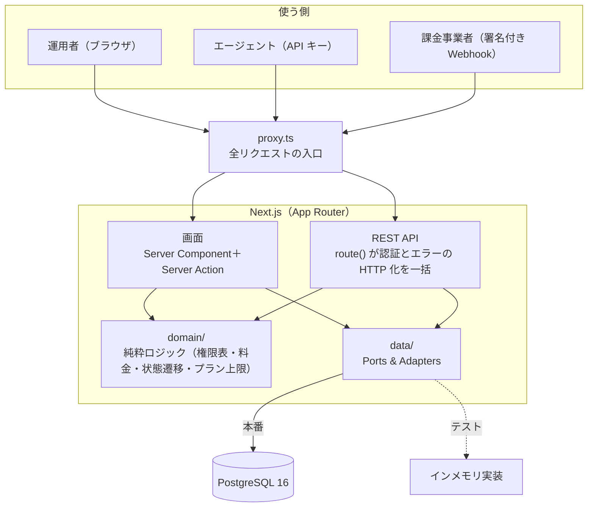
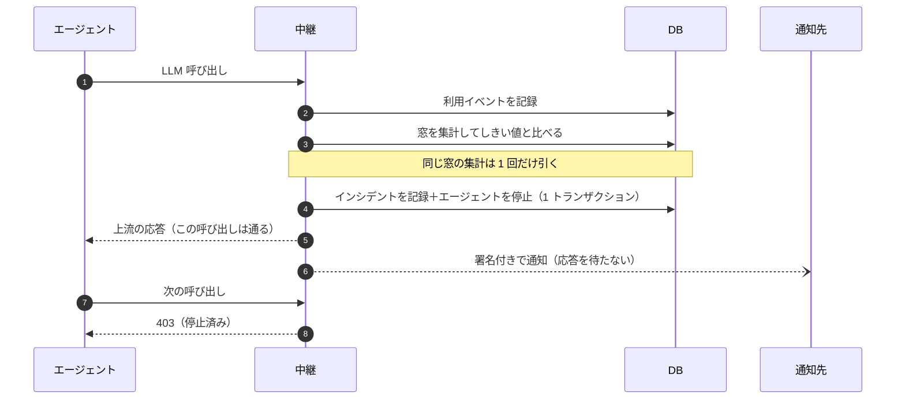
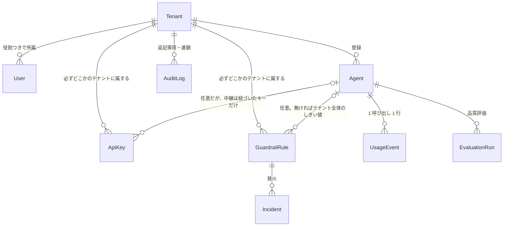

# Agent Ops とは（1 枚で分かる全体像）

> **この文書は読み物で、正本ではない。** 事実の正本は仕様（[`spec.md`](./spec.md)）・受け入れ基準
> （[`roadmap.md`](./roadmap.md)）・API 契約（[`../openapi/openapi.yaml`](../openapi/openapi.yaml)）・
> 設計判断（[`adr/`](./adr/)）の側にあり、ここはそれらへの道案内として「なぜこう作ってあるか」を
> 一度に見せる。**動く数値（テスト件数・実測ミリ秒・しきい値）はここへ書き写さない**（写しは
> 必ずどちらかが古くなる）。構造を説明するのに要る一覧（役割・操作・プラン）だけは書くが、
> **そのときは必ず正本を名指しする** — この文書を読む検出網は無いので、名指しの無い写しは
> 黙って古くなる。具体値は各リンク先を見ること。

## 一言でいうと

社内で動いている **AI エージェントの「暴走と出費」を止めるための運用基盤**。エージェントを作る
ものではなく、**すでに動いているエージェントを運用する側**の道具。

## 何が困るのか

チームが LLM を使うエージェントをいくつも作ると、こうなる。

| 困りごと                                   | この基盤の答え                                                    |
| ------------------------------------------ | ----------------------------------------------------------------- |
| 誰のエージェントがいくら使ったか分からない | 中継して 1 件ずつ台帳に記録し、日次で集計する                     |
| 品質が落ちても気づかない                   | 別の LLM が応答を採点し、前回と比べる                             |
| 止めたいときに止める手段がない             | しきい値を超えたら**自動で止める**／画面から止める                |
| 誰が何をしたか残っていない                 | 改ざん検知付きの監査ログに残す                                    |
| 会社ごとにデータが混ざらないか心配         | テナントに属する資源はすべてテナント境界を持ち、越境は 404 で隠す |

## 中心の仕掛け：LLM 呼び出しを中継する

一番の要はここ。エージェントに Anthropic / OpenAI を直接叩かせず、**この基盤を経由させる**。
経由させるだけで**計測・予算・停止の 3 つが同時に手に入る**のが設計の肝。



ここで効いている決め事（詳細は [ADR-0007](./adr/0007-cost-proxy.md)）:

- **接続先はコードと環境変数だけから決まる。** クライアントの本文・ヘッダ・パスは影響しない
  （サーバ側から任意の宛先へ出させない）。**上流へ送るヘッダにクライアントのものは 1 つも
  混ぜない** — 上流の資格情報はサーバ側の環境変数から取り、クライアントの `Authorization` は
  ここで止める（上流から見える相手はこのサービスだけで、利用者のキーは上流へ届かない）。
- **料金表に無いモデルは中継しない。** 0 円の行を作ると請求の根拠が壊れる。
- **上流へ出た呼び出しは成功も失敗も記録する。** 「課金されたのに台帳に無い」状態を作らない。
  裏返して、**上流へ出る前に断った呼び出しは台帳に残らない** — 無効なキー・エージェントに
  紐づいていないキー・停止済みのエージェント・予算超過・料金表に無いモデル・レート制限・
  本文の検証・この上流への中継が未設定（503）。いずれも課金が発生していないので記録しない（記録すると有効なキー 1 本で行だけ
  を無制限に増やせる）。**台帳を材料にコストやエラー率を数えるときは、断られた呼び出しが
  入っていないことを前提にする** — とくに自動停止したエージェントは、その後の再送が認証の段で
  断られるので台帳では**トラフィックが消えたように見える**（エラーが増えたようには見えない）。
  境界の正本は [ADR-0007](./adr/0007-cost-proxy.md) 決定 5・7。
- **503 は上流の不調ではない。** この上流への中継が設定されていない状態で、運用者が環境変数を
  直すまで続く（クライアントが再送しても解決しない）。
- **記録や通知の失敗で停止を取り消さない**（記録・通知は fail-open）。一方で**予算の確認は
  fail-closed** — 当月の累計を引けなければ中継を断る。**ただししきい値の判定そのものが失敗した
  （DB 障害など）ときは中継を通す** — その 1 回は記録だけ残して先へ進む（エージェントは超過した
  まま動き続けるので、次の判定が通るまで止まらない）。**記録の書き込みだけが落ちたとき**（一時障害・接続の枯渇・
  フェイルオーバ中の読み取り専用など）は、その呼び出しは課金だけが発生して台帳にも残らない
  （DB へまったく届かない状態なら認証の段で断られるので、中継そのものが起きない）。「止める側は fail-closed」が
  意味するのは「判定できたのに止めない」を作らないことで、「判定できなかったら断る」ではない。
- **上流のエラーは番号を選んで中継する。** 番号そのものが共有アカウントの状態を語るため、
  通すのは許可リストに載せた 4xx（400 / 413 / 422。送り主自身の要求についての診断なので握り
  潰さない）だけで、**その本文は機械可読な項目に絞ってから**返す（自由記述には残高・組織名・
  契約ティアが載る）。残りは 502 に写し、**上流の本文は 1 バイトも返さない**（定型文だけ）。**例外は 429** — 「待てば通る」情報には意味があるので番号と `Retry-After` を
  中継し、本文は定型文へ差し替える（クライアントはこの番号でバックオフを書ける）。

## 全体の構成



- **`route()` が全ルートへ無条件で掛けるのは認証・URL の動的セグメントの検証・例外の
  HTTP 化・キャッシュ制御**（セグメントの検証をここに置いたのは、新しい `[id]` を足した人が
  書き足す場所を作らないため。資源 id の形でなければ 404）。**認可はどのルートも本体の先頭で自分で表明する**（3 操作の表なら
  `requireAction`、admin 限定なら `requireAdminRole`、テナントの外側なら
  `requirePlatformAdmin`。役割を問わない参照（`GET /me`）は `requireTenantUser`、エージェント
  資格情報の中継は `requireProxyAgent` という別の表明を使う。網羅は
  `tests/api/rbac-endpoints.test.ts` が OpenAPI から導いて要求する）。`route()` への宣言はそれに**加えて**、追加のレート制限枠を
  持つルートとプランで閉じるルートが「枠を数える前に認可する」ために使う。**本文の検証は
  `route()` の仕事ではなく**各ハンドラが `readJsonBody(request, schema)` を呼ぶ（素の
  `request.json()` を書くと検証を通らないので、本文を取るときは必ずこの関数を使う）。
- **`route()` を迂回できるのは理由付きの表に登録した分だけ**（いまは認証の要らない生存確認・署名で確かめる課金の受信
  Webhook・セッションで認証する CSV のダウンロード）。どれも理由付きの表
  （`tests/route-wrapping.test.ts`）に登録する。後ろ 2 つは素の除外にせず「署名検証へ到達する
  こと」「セッションを自分で確かめていること」「`no-store` を宣言していること」を機械で
  要求している。**生存確認だけはこの表では何も要求していない**が、`tests/api/health.test.ts` が
  成功（200）と DB 障害（503）の両方で `no-store` を固定している（外すと前段のキャッシュ層が
  障害中も古い `ok: true` を配る。ルート自身のコメントがその fail-open を書いている）。
- **画面は自分の REST API を HTTP で呼ばない。** Server Component からデータ層を直接読む
  （認証の二重化と往復を避ける。[ADR-0011](./adr/0011-dashboard-session-and-aggregation.md)）。
  **そのぶん認可も画面側で自分で掛ける** — Server Action は API と同じ許可表を呼ぶ。ただし
  `tests/server-action-guards.test.ts` が機械で見ているのは Origin の一致と CSRF トークンの
  配線までで、**認可の付け忘れを落とす検出網は無い**（規約とレビューで守る）。
- **データ層を差し替えられる**ので、API テストは DB なしで回り、DB 固有の挙動は専用 DB の
  契約テストが受け持つ（[ADR-0006](./adr/0006-ports-and-adapters.md)）。

## 超過してから止まるまで



- **判定は 1 か所だけ**（中継の直後・評価の直後・明示実行という別々の起点が、どれも同じ関数を通る）。
  別経路を作ると「cron では発火するのに中継では発火しない」食い違いが静かに生まれる。
- **通知の完了を待たない**（中継の経路のみ）。待つと受け手の遅さが中継の応答時間に乗る。
- **測れていないものは発火させない。** 呼び出し 0 件の窓・採点 0 件の評価・分母が小さすぎる
  エラー率では止めない（1 回のミスで自動停止させない）。
- 復帰は人の操作で、**手動停止を自動停止で塗り替えない**（誰が止めたかが読めなくなる）。
  詳細は [ADR-0010](./adr/0010-guardrails-and-audit-chain.md)。

## データの形（中心だけ）



**テーブルが `tenantId` を持つ行スコープ方式**（[ADR-0002](./adr/0002-multi-tenant-row-scoping.md)）。
**しきい値のルールはエージェント宛てとテナント全体宛ての両方を取れる**（`agentId` が `null`
ならテナント全体に掛かる）。**キーは列としては `agentId` を省略できるが、中継はエージェントに
紐づいたキーだけを受け付ける**（紐づいていないキーは「誰か」は決まるので 401 ではなく
403 で、利用イベントを記録できないため通さない）。**縛りが掛かるのは「テナントに属する資源」で、例外がある**:
親経由でしか到達しない子テーブル（評価ケースは評価セット経由。列を持たないので、親を
`tenantId` で絞ってから辿る — 子の id だけで直接引かない）と、受信した課金イベントの記録
（顧客 ID からテナントを引けなかったときは `tenantId` が `null` のまま残る）。全エンティティと
列、削除の規則、そして例外の一覧は [`spec.md`](./spec.md) §3（ER 図）が正本。

ここだけは覚えておくとよい 3 点:

- **金額はマイクロ USD の整数**（1 USD = 1,000,000）。浮動小数の誤差を持ち込まない。JSON では
  文字列で運ぶ。
- **API キーはハッシュと先頭数文字だけを保存する。** 平文は発行応答でしか返らない。
- **監査ログは追記専用。** DB トリガが UPDATE を例外なく拒否し、各行が 1 つ前の行のハッシュを
  含む（HMAC の連鎖）ので、途中の行を書き換えると検証で分かる。

## 操作する面

| 面               | 中身                                                                                                                                                    |
| ---------------- | ------------------------------------------------------------------------------------------------------------------------------------------------------- |
| **画面**         | ログイン → ダッシュボード → エージェント一覧 → 詳細（停止・復帰）→ インシデント一覧（一覧の正本は `scripts/lib/step5-criteria.mjs` の `STEP5_SCREENS`） |
| **REST API**     | 一覧は [`api.md`](./api.md)、契約の正本は `openapi/openapi.yaml`                                                                                        |
| **日次レポート** | 画面から CSV で落とせる（画面と同じ集計関数を通る）                                                                                                     |
| **開発用 CLI**   | `npx tsx scripts/issue-user-token.ts --email …` でログイン用トークンを発行                                                                              |

API の Bearer は**用途ごとに分かれていて**（正本は `src/lib/api/auth.ts` の `Principal`、接頭辞は `src/lib/tokens.ts`）、互いに混ざらない（有効な資格情報でも系統が違えば断る）。
断り方は 2 通り: **API キーを人向けの API へ出すと 401**（有効なキーかどうかを答えない）、
**人とプラットフォーム管理者の取り違えは 403**（認証は通り、境界の外側なので認可で落ちる）。

| 系統                   | 誰が使う                                          | 形        |
| ---------------------- | ------------------------------------------------- | --------- |
| ユーザートークン       | 人（API。画面はこの値をそのまま Cookie に載せる） | `aop_u_…` |
| API キー               | エージェント                                      | `aop_k_…` |
| プラットフォーム管理者 | テナントの作成・一覧・プラン変更・課金連携の設定  | 環境変数  |

**画面と受信 Webhook は Bearer を使わない。** 画面はトークンを貼り付けてセッション Cookie を張り
（`HttpOnly` / `SameSite=Strict`、書き込みは CSRF トークンを併用）、課金事業者からの Webhook は
共有鍵の HMAC 署名で確かめる。画面のトークン照合は API と同じ関数を呼び（期限・失効・無効化の
扱いが 2 か所に分かれないように）、署名の比較は定数時間で行う。

ふつうの操作は **viewer / operator / admin** × **view / execute / stop** の許可表で決まり、
**その表（`src/domain/rbac.ts` の `PERMISSIONS`）が唯一の真実の源**（不明なら拒否）。ただし
**認可の軸は 3 つあって混ぜない**（正本は [`spec.md`](./spec.md) §4）: この 3 操作の表、
**`admin` ロール限定**（ユーザーの招待・役割変更・無効化・トークンの一覧と発行と失効・
インシデントの
解決・**ガードレールのルールの登録と無効化と削除**・**監査ログの改ざん検証**。表には無いので
`requireAdminRole` が役割そのものを比べる。ルールだけ役割で縛るのは、止めること自体は `stop`
権限でできても「止まる条件を変える」のは運用の設定変更だから）、**プラットフォーム管理者**
（テナント境界の外側なので表では表せない）。新しいエンドポイントを足すときは、まずどの軸かを
決める — 合う操作が無いからといって `execute` に寄せると、operator が admin 専用の操作を
得てしまう。プランは
**free / pro / enterprise** の 3 段で、エージェント数・**有効なガードレールのルール数**・
レート制限枠・機能の可否を出し分ける（正本は `src/domain/plan.ts` の `PLAN_LIMITS`）。
上限の超過は **409**、**そのプランでは使えない機能は 403**（役割が足りない 403 とは**文言**を
分けてある — 同じ文言だと利用者は役割を変えようとして直らない）。**番号だけでは切り分けられない**
ので文言を読む: 409 には「既に解決済みのインシデント」「発火記録を持つルールは削除できない」の
ように上限と関係ないものもある。free で試すときはエージェント数の枠が最も小さい。トークンの接頭辞の正本は `src/lib/tokens.ts`。

## 「完成」の定義がコマンドになっている

このリポジトリの性格が出ているのはここ。受け入れ基準を人の目視ではなく**1 コマンド**にしてある。

```bash
npm run gate:step7
```

これが 8 Step ぶんの基準（テスト件数・権限の全パターン・料金の誤差・品質の再現率・自動停止の
所要時間・改ざん検知・画面の E2E・Lighthouse・テナント越境の全パターン・冪等性・カバレッジ・
性能ベンチ・既知バグ 0）をまとめて検査し、**1 つでも欠ければ非 0 で終わる**。CI も毎回これを回す。
基準そのものと、文のままでは機械化できないものの解釈は [`roadmap.md`](./roadmap.md) が正本。

とくに効いているのは**基準を「正本から導く」形にしてあること**。

| 検査するもの     | 導出元         | 書き忘れると                                           |
| ---------------- | -------------- | ------------------------------------------------------ |
| 権限の全パターン | 許可表         | 役割や操作を足した時点で赤                             |
| 料金の全モデル   | 単価の JSON    | モデルを足した時点で赤                                 |
| 除外理由の全種類 | enum           | 理由を足した時点で赤                                   |
| 改ざんの全種類   | enum           | 壊れ方を足した時点で赤                                 |
| 越境のパターン   | OpenAPI の定義 | **パスパラメータを持つ**エンドポイントを足した時点で赤 |

**チェックリストを人が更新し忘れても機械が気づく**形で、「テストを足し忘れたまま緑」になりにくい。
ただし**どの網にも守備範囲の外がある** — 越境の導出が見るのはパスパラメータを持つ経路だけで、
**一覧系（`GET /agents` ・ `GET /audit-logs` ・ `GET /usage/daily` など）は導出に入らない**
（契約のパスの半分以上がこちら側）。理由付きの除外表に登録したものも見ない。各検出網が
「何を捉えないか」は `CLAUDE.md` §3 とテスト側のコメントが正本で、**そこを読まずに
「機械が全部見ている」と読まないこと**。

## 触ってみる

```bash
cp .env.example .env       # 管理者トークンと監査の鍵（乱数）を書く。長さの要件は同ファイルに
docker compose up --build  # app が起動時にマイグレーションまで流す
```

デモの筋（正本は `scripts/lib/demo-flow.mjs` の `DEMO_STEPS`）は、生存確認からテナントの作成・
エージェントの登録を経て、**エージェントを止め、監査ログが読めることを確かめる**ところまで。
CI でも毎回この順に通している。

**最後の 2 段がこのシステムの性格をよく表している** — 止められること、そして操作が記録として
残ること。**ただしこの筋が見ているのは「監査ログが 1 件以上あること」まで**で、停止の行が
実際に書かれたかも、連鎖の検証（`GET /audit-logs/verify`）も通していない（そちらはユニットと
契約テストの受け持ち）。手順の具体例（curl 付き）は [README](../README.md) にある。

## もっと詳しく

`docs/` の各ファイルが何を持っているかは [`index.md`](./index.md) にまとめてある（一覧を
ここへ写すと、文書を 1 枚足したときに片方だけが古くなる）。設計判断の理由は
[`adr/`](./adr/)、開発の約束事は [`../CLAUDE.md`](../CLAUDE.md)。
