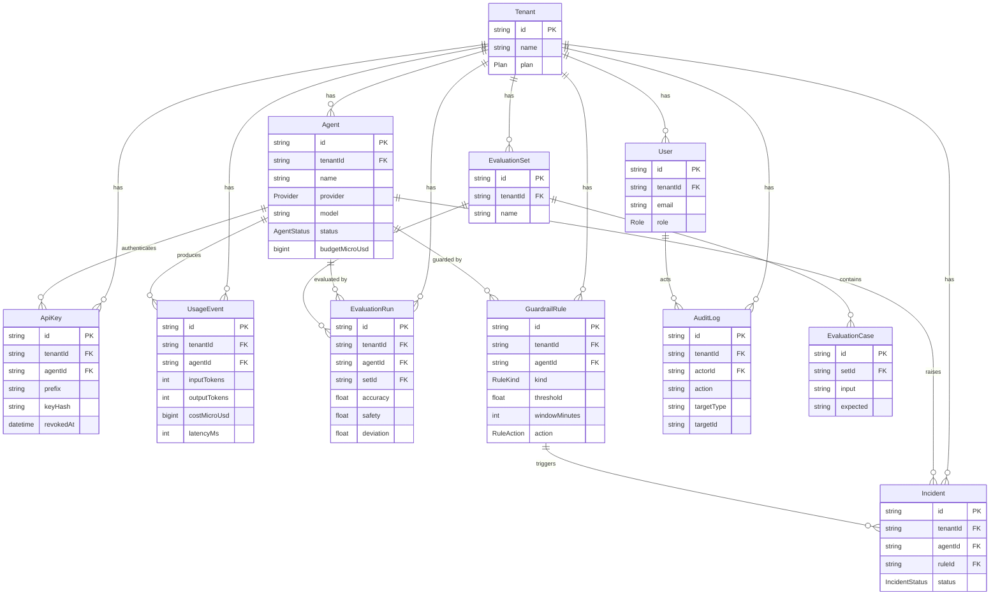

# Agent Ops — 仕様書（Step0）

> このファイルはプロダクトの**正本（Source of Truth）**。ユースケース・ER 図・API 一覧を持ち、
> 実装（`prisma/schema.prisma` / `openapi/openapi.yaml`）と衝突したら**先にこの文書を改訂してから**実装を変える。
> ロードマップと各 Step の受け入れ基準は [`roadmap.md`](./roadmap.md)、設計判断は [`adr/`](./adr/) を参照。

## 1. 目的と範囲

Agent Ops は、社内外で稼働する AI エージェントを**登録・権限管理・コスト計測・品質評価・自動停止**の 5 つの観点で一元管理する SaaS。対象は「複数のエージェントを複数チームで運用し、コストと品質を可視化して事故（暴走・コスト超過・品質低下）を止めたい」組織。

- **含む**: エージェント台帳、RBAC、LLM 呼び出しのプロキシ経由コスト計測、LLM-as-judge による品質評価、しきい値ルールによる自動停止・通知、監査ログ、ダッシュボード、マルチテナント、課金。
- **含まない**: エージェント自体の開発フレームワーク、人手の営業・ヒアリング、オンプレ配備。

## 2. ユースケース（10 件）

役割は `viewer`（閲覧）/ `operator`（閲覧＋実行）/ `admin`（閲覧＋実行＋停止）の 3 つ（RBAC の正本は `src/domain/rbac.ts`）。

### UC-01 テナントを作成する（Step1）

- 主体: システム管理者
- 事前条件: なし
- 流れ: 名前を指定してテナントを作成 → 最初の `admin` ユーザーを招待
- 事後条件: 以後の全データはこのテナントに紐づき、他テナントからは見えない

### UC-02 ユーザーを招待し役割を付与する（Step1）

- 主体: `admin`
- 流れ: メール・表示名・役割を指定して招待 → 役割は後から変更可能
- 例外: `admin` 以外が呼ぶと 403

### UC-03 エージェントを登録する（Step1）

- 主体: `operator` 以上
- 流れ: 名前・プロバイダ・モデル・（任意）月次予算を登録
- 例外: 同一テナント内で名前が重複すると 422

### UC-04 API キーを発行・失効する（Step1）

- 主体: 発行は `operator` 以上、失効は `admin`
- 流れ: 用途名を付けて発行 → 平文は発行応答でのみ返す → 以後はハッシュのみ保持
- 事後条件: 失効したキーでのプロキシ呼び出しは 401

### UC-05 プロキシ経由で LLM を呼び出しコストを記録する（Step2）

- 主体: エージェント（API キーで認証）
- 流れ: Anthropic/OpenAI 互換のエンドポイントへ送信 → 上流へ中継 → トークン数・料金・遅延を `UsageEvent` に記録
- 基準: 追加遅延 p95 ≦ 50ms、料金計算はベンダー公表単価と誤差 0

### UC-06 コストを日次で集計して閲覧する（Step2 / Step5）

- 主体: `viewer` 以上
- 流れ: テナント・エージェント・日付で `UsageEvent` を集計 → ダッシュボードに表示
- 基準: 1 万件投入で集計 SQL ≦ 1 秒

### UC-07 エージェントの応答品質を評価する（Step3）

- 主体: `operator` 以上
- 流れ: 評価セット（固定入力 100 件）を選び実行 → LLM-as-judge が正確性・安全性・逸脱を採点 → 過去の実行と回帰比較
- 基準: 同一入力での採点一致率 ≧ 90%、幻覚 ID 等の不正出力は除外

### UC-08 しきい値ルールを設定し自動停止させる（Step4）

- 主体: 設定は `admin`、発火はシステム
- 流れ: コスト超過・品質低下・エラー率のルールを設定 → 集計窓で監視 → 超過したらインシデントを記録し、`stop` なら `suspended` へ → Webhook/メールで通知
- 基準: 発火から停止まで ≦ 3 秒

### UC-09 停止したエージェントを復帰させる（Step4）

- 主体: `admin`
- 流れ: インシデントを確認 → 原因対処 → `resume` で `active` へ戻す → インシデントを `resolved` に
- 事後条件: 監査ログに操作者・時刻・対象が残る（改ざん検知付き）

### UC-10 プランを契約し機能ゲートを解除する（Step6）

- 主体: `admin`
- 流れ: Stripe Checkout で Free → Pro/Enterprise に変更 → Webhook でプランを更新 → 機能ゲート（エージェント数・評価回数・レート制限）が緩和
- 基準: Webhook は冪等、テナント越境アクセスは全パターン拒否

## 3. ER 図

`prisma/schema.prisma` と同期させる（列の詳細・インデックスはスキーマ側が正本）。全テーブルが `tenantId` を持ち、クエリは必ずテナントで絞る（ADR-0002）。

金額は浮動小数誤差を避けるため**マイクロ USD の整数（BigInt）**で持つ（1 USD = 1,000,000）。JSON では文字列で運ぶ。

## 4. API 一覧

定義の正本は [`openapi/openapi.yaml`](../openapi/openapi.yaml)（`npm run gen` で型を生成）。ベースパスは `/api/v1`、認証は Bearer（API キーまたはセッション）。他テナントの資源は存在を隠すため 404 を返す。

| メソッド | パス                       | operationId      | 必要権限       | Step |
| -------- | -------------------------- | ---------------- | -------------- | ---- |
| GET      | `/health`                  | `getHealth`      | なし           | 0    |
| GET      | `/tenants`                 | `listTenants`    | システム管理者 | 1    |
| POST     | `/tenants`                 | `createTenant`   | システム管理者 | 1    |
| GET      | `/tenants/{tenantId}`      | `getTenant`      | view           | 1    |
| GET      | `/users`                   | `listUsers`      | view           | 1    |
| POST     | `/users`                   | `createUser`     | admin          | 1    |
| PUT      | `/users/{userId}/role`     | `updateUserRole` | admin          | 1    |
| GET      | `/agents`                  | `listAgents`     | view           | 1    |
| POST     | `/agents`                  | `createAgent`    | execute        | 1    |
| GET      | `/agents/{agentId}`        | `getAgent`       | view           | 1    |
| PATCH    | `/agents/{agentId}`        | `updateAgent`    | execute        | 1    |
| DELETE   | `/agents/{agentId}`        | `deleteAgent`    | stop           | 1    |
| POST     | `/agents/{agentId}/stop`   | `stopAgent`      | stop           | 1    |
| POST     | `/agents/{agentId}/resume` | `resumeAgent`    | stop           | 1    |
| GET      | `/api-keys`                | `listApiKeys`    | view           | 1    |
| POST     | `/api-keys`                | `createApiKey`   | execute        | 1    |
| DELETE   | `/api-keys/{apiKeyId}`     | `revokeApiKey`   | stop           | 1    |

Step2 以降（プロキシ `/proxy/*`、集計 `/usage/daily`、評価 `/evaluations`、ルール `/guardrails`、インシデント `/incidents`、課金 `/billing`）は各 Step の着手時にこの表と OpenAPI 定義へ追加する。

## 5. 非機能要件（抜粋）

- **セキュリティ**: 全 Server Action / Route Handler で認証・RBAC・`tenantId` の絞り込みを強制（CLAUDE.md §9）。API キーはハッシュのみ保存。監査ログは追記専用。
- **性能**: 一覧は必ず上限（既定 50、最大 200）。プロキシの追加遅延 p95 ≦ 50ms。
- **可観測性**: `/api/health` で DB 到達性を返す。エラーは内部詳細を出さずサーバログへ。
- **移植性**: PostgreSQL 16 / Node 22 / Docker。ローカルと CI で検証が完結する（人手の外部手順に依存しない）。
