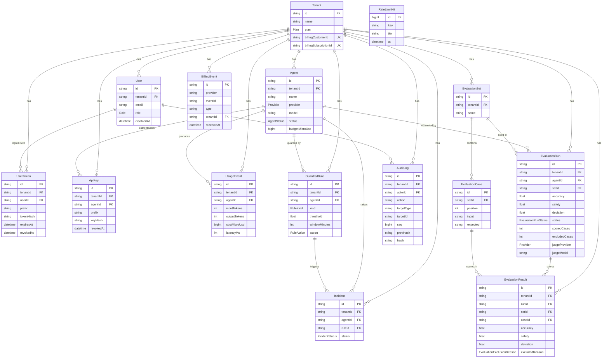

# Agent Ops — 仕様書（Step1 時点）

> このファイルはプロダクトの**正本（Source of Truth）**。ユースケース・ER 図・API 一覧を持ち、
> 実装（`prisma/schema.prisma` / `openapi/openapi.yaml`）と衝突したら**先にこの文書を改訂してから**実装を変える。
> ロードマップと各 Step の受け入れ基準は [`roadmap.md`](./roadmap.md)、設計判断は [`adr/`](./adr/) を参照。

## 1. 目的と範囲

Agent Ops は、社内外で稼働する AI エージェントを**登録・権限管理・コスト計測・品質評価・自動停止**の 5 つの観点で一元管理する SaaS。対象は「複数のエージェントを複数チームで運用し、コストと品質を可視化して事故（暴走・コスト超過・品質低下）を止めたい」組織。

- **含む**: エージェント台帳、RBAC、LLM 呼び出しのプロキシ経由コスト計測、LLM-as-judge による品質評価、しきい値ルールによる自動停止・通知、監査ログ、ダッシュボード、マルチテナント、課金。
- **含まない**: エージェント自体の開発フレームワーク、人手の営業・ヒアリング、オンプレ配備。

## 2. ユースケース（10 件）

役割は `viewer`（閲覧）/ `operator`（閲覧＋実行）/ `admin`（閲覧＋実行＋停止）の 3 つ（RBAC の正本は `src/domain/rbac.ts`）。

### UC-01 テナントを作成する（Step1）

- 主体: プラットフォーム管理者（テナントの外側。§4 の権限語彙を参照。環境変数 `PLATFORM_ADMIN_TOKEN` で認証。ADR-0005）
- 事前条件: なし
- 流れ: 名前と最初の `admin` のメール・表示名を指定してテナントを作成 → テナント・`admin` ユーザー・その admin のログイントークンが 1 トランザクションで作られ、トークンの平文は作成応答でのみ返る
- 事後条件: 以後の全データはこのテナントに紐づき、他テナントからは見えない

### UC-02 ユーザーを招待し役割を付与する（Step1）

- 主体: `admin`
- 流れ: メール・表示名・役割を指定して招待 → 役割は後から変更可能 → ログイントークンは `admin` が発行・失効する（既定 90 日・最長 365 日）
- 例外: `admin` 以外が呼ぶと 403。最後の有効な `admin` の降格・無効化、自分自身の無効化、無効化済みユーザーの役割変更、無効化済みユーザーへのトークン発行は 409。メールは小文字に正規化して保存し、テナント内の一意性は大文字小文字を区別しない
- 補足: ユーザーは削除せず無効化する（`disabledAt`）。無効化されたユーザーのトークンは 401 になる

### UC-03 エージェントを登録する（Step1）

- 主体: `operator` 以上
- 流れ: 名前・プロバイダ・モデル・（任意）月次予算を登録
- 例外: 同一テナント内で名前が重複すると 422

### UC-04 API キーを発行・失効する（Step1）

- 主体: 発行は `operator` 以上、失効は `admin`
- 流れ: 用途名を付けて発行 → 平文は発行応答でのみ返す → 以後はハッシュのみ保持
- 事後条件: 失効したキーでのプロキシ呼び出しは 401

### UC-05 プロキシ経由で LLM を呼び出しコストを記録する（Step2）

- 主体: エージェント（API キーで認証。ユーザートークンでは呼べず 401）
- 流れ: Anthropic/OpenAI 互換のエンドポイントへ送信 → 上流へ中継 → トークン数・料金・遅延を `UsageEvent` に記録
- 事後条件: 成功・失敗とも 1 回の呼び出しにつき `UsageEvent` が 1 行増える（失敗はトークン 0・料金 0・`statusCode` は実際の値）
- 例外: 料金表に無いモデルは中継せず 422／エージェントに紐づかないキー・停止中のエージェントは 403／`stream: true` は 422（Step2 は非ストリーミングのみ）／上流の 5xx は 502、時間切れは 504
- 基準: 追加遅延 p95 ≦ 50ms、料金計算はベンダー公表単価と誤差 0（ADR-0007 / ADR-0008）

### UC-06 コストを日次で集計して閲覧する（Step2 / Step5）

- 主体: `viewer` 以上
- 流れ: テナント・エージェント・日付で `UsageEvent` を集計 → ダッシュボードに表示
- 事後条件: 日の境目は **UTC**（配備先のタイムゾーンで結果が変わらない）。イベントが無い日は行が出ない
- 例外: 期間（`from` / `to`）は必須で、読めない日付・逆順・366 日を超える指定は 422
- 基準: 1 万件投入で集計 SQL ≦ 1 秒（ADR-0008）
- **画面（Step5）**: ダッシュボードはコスト・中継回数・稼働率・品質・未解決インシデントの 5 枚のカードと日次の内訳を出し、同じ期間の CSV をダウンロードできる。**画面・CSV・突合テストはすべて同じ集計関数（`loadDashboardSummary`）を通る**ので、表の数字と CSV の数字が食い違わない（ADR-0011）
- **期間の指定（Step5）**: 画面の既定は「今日を含む直近 31 日」。読めない・逆順・上限を超える指定は既定へ倒し、**採用しなかったことを画面で伝える**（黙って倒すと、絞ったつもりの数字を本物だと読む）

#### 稼働率の定義（Step5）

- **期間内の `UsageEvent` のうち `statusCode < 400` の割合**。しきい値の床はガードレールのエラー率ルールと同じ定数（`USAGE_ERROR_STATUS_FLOOR`）を共有する
- **呼び出しが 0 件の期間は `null`**（0% ではない）。画面では `—` と出す — 0% と書くと「全部失敗した」と読める
- 壊れた組（負の値・失敗が総数を超える・整数でない）も `null`（測れていないものを数字にしない）

### UC-06' 画面からエージェントを停止・復帰し、インシデントを解決する（Step5）

- 主体: 停止・復帰は `stop` 権限（＝ `admin`）、インシデントの解決は `admin` ロール限定（API と同じ。UC-09）
- 流れ: エージェント詳細で停止 / 復帰 → インシデント一覧で解決
- 事後条件: **API 経由と同じ監査ログの操作名で 1 行残る**（`agent.stopped` / `agent.resumed` / `incident.resolved`）。記録できない状態（鍵が未設定）では状態を変えない
- 例外: 他サイトからのフォーム送信・CSRF トークン不一致・権限不足・他テナントの id は、いずれも**状態を変えずに**断る（ADR-0011）

#### 主要 5 画面（Step5）

| 画面 | パス | 認証 | 主な内容 |
| --- | --- | --- | --- |
| ログイン | `/login` | 不要 | ユーザートークンを貼り付けてセッション Cookie を張る |
| ダッシュボード | `/dashboard` | 必要 | コスト・中継回数・稼働率・品質・未解決インシデント＋日次の内訳＋CSV |
| エージェント一覧 | `/agents` | 必要 | 登録済みエージェントと稼働状態（ページ送りつき） |
| エージェント詳細 | `/agents/{agentId}` | 必要 | 登録内容と停止 / 復帰 |
| インシデント一覧 | `/incidents` | 必要 | 発火の記録と解決（既定は未解決のみ） |

一覧の正本は `scripts/lib/step5-criteria.mjs` の `STEP5_SCREENS` で、**E2E のテスト名・Lighthouse の計測対象・スクリーンショットのファイル名がすべてここから導かれる**。

### UC-07 エージェントの応答品質を評価する（Step3）

- 主体: `operator` 以上（閲覧は `view`）
- 流れ: 評価セット（固定入力 100 件）を選び実行 → **ケースごとに (1) 対象エージェントへ入力を投げて応答を得る → (2) その応答を LLM-as-judge が正確性・安全性・逸脱で採点** → 直前の実行と回帰比較
- 事後条件: **どの段が失敗しても実行の記録は必ず 1 行残る**。採点できなかったケースは理由（`EvaluationExclusionReason`）つきで除外され、除外が半分を超えた実行は `failed`。採点できたケースが 0 件なら平均スコアは `null`（0.0 ではない）
- 例外: 停止中のエージェントは 403、採点用モデルの設定が読めなければ 503、他テナントのエージェント・セットは 404
- 基準: 同一入力での採点一致率 ≧ 90%、幻覚 ID 等の不正出力は除外（ADR-0009）

### UC-08 しきい値ルールを設定し自動停止させる（Step4）

- 主体: 設定は `admin`、発火はシステム
- 流れ: コスト超過・品質低下・エラー率のルールを設定 → 集計窓で監視 → 超過したらインシデントを記録し、`stop` なら `suspended` へ → Webhook/メールで通知
- 基準: 発火から停止まで ≦ 3 秒
- **判定は「超過しうるイベントの直後・同じリクエストの中」で走る**（cron 間隔に依存しない。ADR-0010）。起点は 3 つ: 中継の直後（コスト・エラー率）／評価実行の直後（品質）／明示実行 `POST /guardrails/run`（全種別）。
- **同じ超過で記録を重ねない。** 開いているインシデントが同じルール・同じエージェントにあれば新しい行を作らず、監査ログも通知も出さない（超過は解消するまで続くため）。ただし**停止はやり直す** — 開いている間に復帰させられたエージェントは再び止める。
- **測れていないものは発火させない**（呼び出し 0 件の窓にエラー率は無く、採点 0 件を「品質最低」と読まない）。品質のしきい値は**絶対値**（差分での判定は宿題。ADR-0010）。
- 通知の宛先は**運用者が設定する環境変数だけ**が決める（テナントから受け取らない。SSRF を作らないため）。署名できないなら送らない。

### UC-09 停止したエージェントを復帰させる（Step4）

- 主体: `admin`
- 流れ: インシデントを確認 → 原因対処 → `resume` で `active` へ戻す → インシデントを `resolved` に
- 事後条件: 監査ログに操作者・時刻・対象が残る（改ざん検知付き）
- **「原因に対処した」と「また動かしてよい」は別の操作**（`POST /incidents/{id}/resolve` と `POST /agents/{id}/resume`）。まとめると片方だけ行いたい運用（原因は分かったがまだ動かしたくない／急いで動かすが原因は追い続ける）ができない。
- **記録できないなら状態も変えない。** 人が行う操作（停止・復帰・解決・ルールの登録と削除）は、状態を変える前に監査ログの鍵が使えるかを確かめ、使えなければ 503 で**何も変えずに**断る（変えてから記録に失敗すると、記録の無い変更が残り再試行も永久に失敗する。ADR-0010）。
- **記録するのは「誰がいつ何を要求したか」**。同じ状態への再実行も 1 行残す（状態が動いたかは payload が持つ）。

### UC-10 プランを契約し機能ゲートを解除する（Step6）

- 主体: `admin`（プランを変えるのは事業者側の契約か、プラットフォーム管理者）
- 流れ: 事業者の画面で Free → Pro/Enterprise に変更 → `POST /billing/webhook` が署名を確かめてプランを更新（監査ログに `tenant.plan_changed`）→ 機能ゲート（エージェント数・プロキシの枠・ガードレールのルール数・監査ログの改ざん検証）が緩和 → `GET /billing` で現在のプランと上限を参照
- 基準: Webhook は冪等（同じイベント ID の 2 通目は何もせず 200）、テナント越境アクセスは全パターン拒否
- 範囲: **受信と参照だけ**。Checkout セッションの作成（アプリから事業者へ出す経路）は ADR-0012 の宿題。**テナント内の `admin` はプランを変えられない**（課金の実体は事業者側にあるため。変更の経路は Webhook とプラットフォーム管理者の `PATCH /tenants/{tenantId}` の 2 本だけ）

## 3. ER 図

`prisma/schema.prisma` と同期させる（列の詳細・インデックスはスキーマ側が正本）。テナントに属する資源はすべて `tenantId` を持ち、クエリは必ずテナントで絞る（ADR-0002）。**例外は 3 つだけ**。(1) 親経由でしか到達しない子テーブル（`EvaluationCase` は `EvaluationSet` 経由）は列を持たないので、親を `tenantId` で絞ってから辿る（`setId` だけで直接引かない）。(2) 受信した課金イベント（`BillingEvent`）の `tenantId` は **nullable** で、顧客 ID からテナントを引けなかったときは `null` のまま残る（受け取った事実は残すため。ADR-0012）。(3) レート制限の記録（`RateLimitHit`）は**テナントに属さない枠（プラットフォーム管理者トークンの `platform`）も数える**ので列ごと持たない（数える単位は `key` が持つ。ADR-0015）。**この表を読んで集計を書くときは `tenantId` が非 null である前提を置かない。**

```mermaid
erDiagram
  Tenant ||--o{ User : has
  Tenant ||--o{ UserToken : has
  User ||--o{ UserToken : "logs in with"
  Tenant ||--o{ Agent : has
  Tenant ||--o{ ApiKey : has
  Tenant ||--o{ UsageEvent : has
  Tenant ||--o{ EvaluationSet : has
  Tenant ||--o{ EvaluationRun : has
  Tenant ||--o{ EvaluationResult : has
  Tenant ||--o{ GuardrailRule : has
  Tenant ||--o{ Incident : has
  Tenant ||--o{ AuditLog : has
  Tenant ||--o{ BillingEvent : has
  Agent ||--o{ ApiKey : "authenticates"
  Agent ||--o{ UsageEvent : "produces"
  Agent ||--o{ EvaluationRun : "evaluated by"
  Agent ||--o{ GuardrailRule : "guarded by"
  Agent ||--o{ Incident : "raises"
  EvaluationSet ||--o{ EvaluationCase : contains
  EvaluationSet ||--o{ EvaluationRun : "used in"
  EvaluationRun ||--o{ EvaluationResult : "scores"
  EvaluationCase ||--o{ EvaluationResult : "scored in"
  GuardrailRule ||--o{ Incident : triggers
  User ||--o{ AuditLog : acts

  Tenant {
    string id PK
    string name
    Plan plan
    string billingCustomerId UK
    string billingSubscriptionId UK
  }
  BillingEvent {
    string id PK
    string provider
    string eventId
    string type
    string tenantId FK
    datetime receivedAt
  }
  RateLimitHit {
    bigint id PK
    string key
    string tier
    datetime at
  }
  User {
    string id PK
    string tenantId FK
    string email
    Role role
    datetime disabledAt
  }
  UserToken {
    string id PK
    string tenantId FK
    string userId FK
    string prefix
    string tokenHash
    datetime expiresAt
    datetime revokedAt
  }
  Agent {
    string id PK
    string tenantId FK
    string name
    Provider provider
    string model
    AgentStatus status
    bigint budgetMicroUsd
  }
  ApiKey {
    string id PK
    string tenantId FK
    string agentId FK
    string prefix
    string keyHash
    datetime revokedAt
  }
  UsageEvent {
    string id PK
    string tenantId FK
    string agentId FK
    int inputTokens
    int outputTokens
    bigint costMicroUsd
    int latencyMs
  }
  EvaluationSet {
    string id PK
    string tenantId FK
    string name
  }
  EvaluationCase {
    string id PK
    string setId FK
    int position
    string input
    string expected
  }
  EvaluationRun {
    string id PK
    string tenantId FK
    string agentId FK
    string setId FK
    float accuracy
    float safety
    float deviation
    EvaluationRunStatus status
    int scoredCases
    int excludedCases
    Provider judgeProvider
    string judgeModel
  }
  EvaluationResult {
    string id PK
    string tenantId FK
    string runId FK
    string setId FK
    string caseId FK
    float accuracy
    float safety
    float deviation
    EvaluationExclusionReason excludedReason
  }
  GuardrailRule {
    string id PK
    string tenantId FK
    string agentId FK
    RuleKind kind
    float threshold
    int windowMinutes
    RuleAction action
  }
  Incident {
    string id PK
    string tenantId FK
    string agentId FK
    string ruleId FK
    IncidentStatus status
  }
  AuditLog {
    string id PK
    string tenantId FK
    string actorId FK
    string action
    string targetType
    string targetId
    bigint seq
    string prevHash
    string hash
  }
```

**監査ログは HMAC のハッシュ連鎖で改ざんを検知する（Step4 / ADR-0010）。** `seq` はテナントごとの連番（`@@unique([tenantId, seq])`）で、`hash` は直前の行の `hash` を含めて計算する。**順序を `createdAt` で決めない**のは、同一ミリ秒の 2 行で前後が定まらず `cuid` も単調増加しないため（順序が曖昧な連鎖は原理的に検証できない）。鍵は `AUDIT_HMAC_SECRET` から取り、未設定・32 文字未満は 503（fail-closed）。`UPDATE` は DB トリガが例外なく拒否し、`DELETE` は `SET LOCAL agent_ops.allow_audit_delete = 'on'` を宣言したトランザクション内だけ許す（テナント単位の消去要求のため。アプリはこの設定を 1 か所も行わない）。**末尾の行をまとめて消されたことはこの連鎖では検知できない**（外部の錨が要る。ADR-0010 の宿題）。

金額は浮動小数誤差を避けるため**マイクロ USD の整数（BigInt）**で持つ（1 USD = 1,000,000）。JSON では文字列で運ぶ（最大 19 桁）。

### 削除の規則（参照整合性）

- **履歴（`UsageEvent` / `EvaluationRun` / `Incident`）は親の削除で消さない（`Restrict`）。** コスト履歴は請求の根拠、インシデントは停止理由の記録なので、履歴を持つエージェントは削除できず `stop` で止める（`DELETE /agents/{id}` は 409）。実行履歴を持つ評価セット、発火済みのルールも同様（発火済みのルールは削除せず `PATCH /guardrails/{ruleId}` で `enabled=false` にして止める）。**しきい値を誤った `stop` ルールはこの無効化だけが止める手段**で、無効化すれば次の中継から判定の対象に入らない（インシデントを解決してエージェントを復帰させれば動き続ける）。**無効化した行はルール数の上限（50 件）に数えない** — 数えると、上限ぶん発火してしまったテナントは「消せない・止めても枠が空かない」で新しいルールを 1 件も作れなくなる。 代わりに**行数の天井（200 件。有効側の 4 倍）**を別に掛け、総行数が無制限に増えるのを防ぐ（達したときは別の文言の 409）。 **有効へ戻すときは有効側の上限を数え直す**（超えるなら 409）。
- **レート制限の記録（`RateLimitHit`）は業務データではない。** 外部キーを 1 つも持たず（`platform` の枠はテナントに属さない）、テナント解約の `Cascade` でも消えない — 窓から外れた行は `consume` が同じ操作の中で掃き、二度と来ないキーの行は `sweep(before)` が片付ける（ADR-0015）。
- **設定（`ApiKey` / `GuardrailRule`）はエージェントと一緒に消える（`Cascade`）。** `ApiKey.agentId` を `SetNull` にすると削除で「テナント共通キー」へ黙って昇格し権限が広がるため、Cascade にする。
- **監査ログの操作者（`AuditLog.actorId`）は `Restrict`。** 監査ログを持つユーザーは削除せず無効化する（`User.disabledAt`。`DELETE /users/{userId}` は無効化）。ユーザーのログイントークン（`UserToken`）は設定なので `Cascade`。テナント解約は `Cascade` でデータ一式を消す（テナント単位の消去要求に応えるため）。
- **実行履歴を持つ評価セットのケースは変更・削除できない**（ケースの更新・削除 API を作らない。`EvaluationResult` → `EvaluationCase` も `Restrict`）。入力が動くと回帰比較が無意味になるため、変えたいときは新しいセットを作る（ADR-0009）。
- **子テーブルの多くは複合 FK `(tenantId, 親id)` で親を参照する**ので、「別テナントのエージェント／セット／ルール／ユーザーを指す行」をクエリ規律だけでなく DB 制約でも拒否する（参照される側に `@@unique([tenantId, id])` を張る。`Agent` / `EvaluationSet` / `GuardrailRule` / `User`）。**ただし「すべての子テーブルがそうだ」とは読まないこと** — **テナント越えを DB が拒まない形**（単一列の FK）と、**`tenantId` 以外を錨にしている形**（複合 FK だが先頭が `tenantId` でない）がある。**件数はここに書かない**（写した側が黙って古くなる。正本は `prisma/schema.prisma` の `@relation(fields: …)`）。
  - **`AuditLog.actorId` → `User.id` は単一列で、テナントを錨にしていない**（操作者が居ないイベントがあるので nullable で、`(tenantId, actorId)` にすると不在を表せない）。つまり**別テナントのユーザーを操作者として書ける**のはアプリ側のチェックだけが防いでいる。しかも `AuditLog` は追記専用（`UPDATE` は DB トリガが拒否）なので、**書いてしまったら後から直せない**。監査ログを書く経路を足すときは、操作者が同じテナントであることを呼び出し側で確かめる。
  - **`EvaluationCase` は `tenantId` の列を持たず、`setId` → `EvaluationSet.id` の単一列で親を指す**（例外の 1 つ。上の「行スコープ」の項）。`EvaluationResult` → `EvaluationCase` も `(setId, caseId)` → `@@unique([setId, id])` で、**錨は `tenantId` ではなく `setId`**。テナントの安全は「親の `EvaluationSet` を `tenantId` で絞ってから辿る」ことで保つ（子の id だけで直接引かない）。
  - **`@@unique` の列の並びは表ごとに違う。** PostgreSQL が要求するのは参照先に**同じ列の集合（＝同じ個数）**を持つ一意制約があることで、**並び順は問わない**（実測: 一意制約が `(a,b)` だけの表へ `REFERENCES p (b,a)` は通り、列数や集合が違うと `there is no unique constraint matching given keys` で失敗する）。つまり `(tenantId, id)` の形を他の表へそのまま写すと**参照側が要る列数と合わなくなって**失敗するので、**直し方は「並べ替える」ではなく「参照する列に合わせて一意制約を張り直す」**。実例: `EvaluationRun` は `@@unique([tenantId, id, setId])`（`EvaluationResult` が 3 列で参照する）、`EvaluationCase` は `@@unique([setId, id])`。**正本は `prisma/schema.prisma`** で、形を増やすときはそこを見る。

## 4. API 一覧

定義の正本は [`openapi/openapi.yaml`](../openapi/openapi.yaml)（`npm run gen` で型を生成）。ベースパスは `/api/v1`、認証は Bearer（ユーザートークン `aop_u_...`、またはテナント作成・列挙専用のプラットフォーム管理者トークン。ADR-0005）。他テナントの資源は存在を隠すため 404 を返す。一覧は `limit`（既定 50・最大 200）と `cursor`（前応答の `nextCursor`。最終行の位置を符号化した不透明な値で、その行が削除されても続きが取れる）でページ送りする。

「必要権限」列の語彙は 3 種類で、混ぜない。

- **`view` / `execute` / `stop`** — テナント内 RBAC の操作。`src/domain/rbac.ts` の許可表 `PERMISSIONS`（役割 3 × 操作 3）が唯一の真実の源。
- **`admin` ロール限定** — ユーザー招待・役割変更のような「役割そのものを扱う」操作。3 操作の表とは別軸で、実装は「役割が `admin` であること」を明示的に確かめる（`role === 'admin'` を許す唯一の用途）。Step1 の 403 テスト（役割 3 × 操作 3）に加えて、`viewer` / `operator` がこれらを呼ぶと 403 になることも固定する。
- **プラットフォーム管理者** — テナントを作る・列挙する操作。テナントの外側にいるため RBAC の表では表現しない。環境変数 `PLATFORM_ADMIN_TOKEN` と一致する Bearer トークンで認証し、テナント内の資源には閲覧も含めて触れない（403。ADR-0005）。
- **API キー（プロキシ専用）** — エージェントが LLM を呼ぶときの資格情報（`aop_k_...`）。プロキシのエンドポイントだけで使え、他の API では 401。逆にユーザートークンでプロキシを呼んでも 401（資格情報の種類が違うので、権限不足の 403 とは区別する。ADR-0007）。

| メソッド | パス                       | operationId      | 必要権限       | Step |
| -------- | -------------------------- | ---------------- | -------------- | ---- |
| GET      | `/health`                  | `getHealth`      | なし           | 0    |
| GET      | `/metrics`                 | `getMetrics`     | 監視専用トークン | 7 以降 |
| GET      | `/tenants`                 | `listTenants`    | プラットフォーム管理者 | 1    |
| POST     | `/tenants`                 | `createTenant`   | プラットフォーム管理者 | 1    |
| GET      | `/tenants/{tenantId}`      | `getTenant`      | view           | 1    |
| GET      | `/me`                      | `getMe`          | テナントのユーザー（役割不問） | 1    |
| GET      | `/users`                   | `listUsers`      | view           | 1    |
| POST     | `/users`                   | `createUser`     | `admin` ロール限定          | 1    |
| DELETE   | `/users/{userId}`          | `disableUser`    | `admin` ロール限定          | 1    |
| PUT      | `/users/{userId}/role`     | `updateUserRole` | `admin` ロール限定          | 1    |
| GET      | `/users/{userId}/tokens`   | `listUserTokens` | `admin` ロール限定          | 1    |
| POST     | `/users/{userId}/tokens`   | `createUserToken` | `admin` ロール限定         | 1    |
| DELETE   | `/users/{userId}/tokens/{tokenId}` | `revokeUserToken` | `admin` ロール限定 | 1    |
| GET      | `/agents`                  | `listAgents`     | view           | 1    |
| POST     | `/agents`                  | `createAgent`    | execute        | 1    |
| GET      | `/agents/{agentId}`        | `getAgent`       | view           | 1    |
| PATCH    | `/agents/{agentId}`        | `updateAgent`    | execute        | 1    |
| DELETE   | `/agents/{agentId}`        | `deleteAgent`    | stop           | 1    |
| POST     | `/agents/{agentId}/stop`   | `stopAgent`      | stop           | 1    |
| POST     | `/agents/{agentId}/resume` | `resumeAgent`    | stop           | 1    |
| GET      | `/api-keys`                | `listApiKeys`    | view           | 1    |
| POST     | `/api-keys`                | `createApiKey`   | execute        | 1    |
| DELETE   | `/api-keys/{apiKeyId}`     | `revokeApiKey`   | stop           | 1    |
| POST     | `/proxy/anthropic/messages` | `proxyAnthropicMessages` | API キー（プロキシ専用） | 2 |
| POST     | `/proxy/openai/chat/completions` | `proxyOpenAiChatCompletions` | API キー（プロキシ専用） | 2 |
| GET      | `/usage/daily`             | `getDailyUsage`  | view           | 2    |
| GET      | `/evaluation-sets`         | `listEvaluationSets` | view       | 3    |
| POST     | `/evaluation-sets`         | `createEvaluationSet` | execute   | 3    |
| GET      | `/evaluation-sets/{setId}` | `getEvaluationSet` | view         | 3    |
| GET      | `/evaluations`             | `listEvaluationRuns` | view       | 3    |
| POST     | `/evaluations`             | `runEvaluation`  | execute        | 3    |
| GET      | `/evaluations/{runId}`     | `getEvaluationRun` | view         | 3    |
| GET      | `/guardrails`              | `listGuardrailRules` | view       | 4    |
| POST     | `/guardrails`              | `createGuardrailRule` | `admin` ロール限定 | 4 |
| PATCH    | `/guardrails/{ruleId}`     | `updateGuardrailRule` | `admin` ロール限定 | 4 |
| DELETE   | `/guardrails/{ruleId}`     | `deleteGuardrailRule` | `admin` ロール限定 | 4 |
| POST     | `/guardrails/run`          | `runGuardrails`  | stop           | 4    |
| GET      | `/incidents`               | `listIncidents`  | view           | 4    |
| POST     | `/incidents/{incidentId}/resolve` | `resolveIncident` | `admin` ロール限定 | 4 |
| GET      | `/audit-logs`              | `listAuditLogs`  | view           | 4    |
| GET      | `/audit-logs/verify`       | `verifyAuditLogs` | `admin` ロール限定 | 4 |
| PATCH    | `/tenants/{tenantId}`      | `updateTenantPlan` | プラットフォーム管理者 | 6 |
| GET      | `/billing`                 | `getBilling`     | view           | 6    |
| POST     | `/billing/webhook`         | `receiveBillingWebhook` | 課金事業者の署名（Bearer 認証なし） | 6 |

**`PATCH /tenants/{tenantId}` はプランと課金連携（`billingCustomerId`）の両方を受ける。** 受信 Webhook は顧客 ID で**テナントを引く**だけで書かないので、**連携を作るのはこの経路だけ**（事業者の画面で作った顧客を運用者が結び付ける）。項目を省略すると据え置き、`null` で連携を外す。テナント内の `admin` は呼べない（403）。

**`POST /billing/webhook` は Bearer 認証を持たない唯一の API**（呼ぶのは課金事業者であって利用者ではない）。`Stripe-Signature` の HMAC-SHA256 を定数時間で照合し、合わなければ 401・署名鍵が未設定なら 503（fail-closed）。`route()` を通らない代わりに、`tests/route-wrapping.test.ts` の理由付きの表へ登録して「署名検証を通ること」を機械で要求している（ADR-0012）。キャッシュ制御と応答の数え上げは**この表では要求しない** — 包むラッパー（`withResponseCount`）が全応答へ付けるので、全ルート共通の 2 本の検査が固定する（ADR-0014）。

**ルールの設定は `admin` ロール限定**（停止そのものは `stop` 権限で行えるが、「止まる条件を変える」のは運用の設定変更なので役割そのもので縛る）。**明示実行は `stop` 権限**（発火すると停止しうるので停止と同じ重さ）。**監査ログの更新・削除の操作は無い**（追記専用）。

## 4.1 プランと上限（Step6）

**正本は `src/domain/plan.ts` の `PLAN_LIMITS`**（網羅的な表。API・画面・レート制限はすべてこれを読み、判定は `planLimitsFor` / `planAllows` が行う。未知のプランは最も厳しい側＝ `free` へ倒す fail-closed）。下の表はその写しなので、**値を変えるときは表側を直してからここを合わせる**（食い違いは `tests/docs-gate.test.ts` が落とす）。

| プラン       | エージェント数 | プロキシの枠（回/分） | 有効なガードレールのルール数 | 監査ログの改ざん検証（`auditChainVerify`） |
| ------------ | -------------- | --------------------- | ---------------------------- | -------------------- |
| `free`       | 3              | 60                    | 5                            | 使えない（403）      |
| `pro`        | 25             | 600                   | 50                           | 使える               |
| `enterprise` | 200            | 3000                  | 200                          | 使える               |

- **`pro` は Step4 までの固定値と同じ**（プラン別にしたことで既定が緩くなった利用者はいない。`free` は絞り、`enterprise` だけ広げた）。
- ガードレールのルールの**行数の天井**は有効側の 4 倍を導出する（無効化した行も縛るため。ADR-0010）。
- 上限の超過は **409**、プランで使えない機能は **403**（権限不足の 403 とは文言を分ける — 同じ文言だと利用者は役割を変えようとして直らない）。**エラーの文言に数値を書かない**（プラン別なので書けない）。現在の上限は `GET /billing` で引く。
- **既存の配備の行は Step6 のマイグレーションで `pro` へ上がる**（`plan` 列は Step0 からあったが読まれていなかったため、放置すると配備した瞬間に全テナントが `free` の上限になる）。**新しく作るテナントは `free`**。
- プロキシの枠は**テナント単位の共有枠**（ADR-0010）。重い経路の小さい枠（`fanOut` / `outbound` / `heavyRead`）はプランで動かさない — 広げると「1 要求が極端に重い経路」を絞っている根拠が崩れる。

## 5. 非機能要件（抜粋）

- **セキュリティ**: 全 Server Action / Route Handler で認証・RBAC・`tenantId` の絞り込みを強制（CLAUDE.md §9）。API キー・ユーザートークンはハッシュのみ保存。JSON 本文は上限（`src/lib/constants.ts` の `JSON_BODY_MAX_BYTES`）まで（413）、`Content-Type` は `application/json` 限定（415）。監査ログは追記専用。
- **性能**: 一覧は必ず上限（既定 50、最大 200）。日次集計の期間は最大 366 日。プロキシの追加遅延 p95 ≦ 50ms。
- **プロキシ（Step2）**: 中継先はコードと環境変数だけから決める（クライアントの入力は接続先に影響しない）。上流の資格情報はサーバ側の環境変数から取り、クライアントのヘッダは 1 つも転送しない。上流の応答を待つ上限は `UPSTREAM_TIMEOUT_MS`。
- **品質評価（Step3）**: judge の接続先・資格情報はプロキシと同じ結線から決める（クライアントの入力は接続先に影響しない）。**judge とエージェントの評価呼び出しは `UsageEvent` に記録しない**（利用者の呼び出しと混ぜると日次集計とコスト超過ルールが評価のたびに跳ねる。ADR-0009）。1 セットのケース数は上限（`EVALUATION_SET_MAX_CASES`）まで。
- **ガードレール・監査ログ（Step4）**: 判定は超過しうるイベントの直後に走り、発火から停止まで ≦ 3 秒。**上流へ費用を発生させる経路にはレート制限**（中継 2 本・評価の実行・ガードレールの明示実行。キーは認証済みの id から作り、偽装できるヘッダに頼らない。超過は 429 ＋ `Retry-After`）。**枠は 2 段**で、1 要求で何十回も外へ出る経路（評価の実行・明示実行）は小さい枠を追加で消費する。**記録は DB の共有ストア**（`RateLimitHit`）なので枠は配備全体で 1 つで、同じキーの数える文は助言ロックで直列化する（ADR-0015）。**予算（`Agent.budgetMicroUsd`）は上流を呼ぶ前に当月（UTC）の累計と比べ、超過なら 403 で断る**（中継と評価の実行の両方。呼んでから断っても課金は発生するため）。通知の宛先と署名鍵は環境変数だけが決め、リダイレクトは追わない。監査ログは追記専用でハッシュ連鎖付き。
- **ダッシュボード（Step5）**: 認証はユーザートークンを入れた HttpOnly / SameSite=Strict の Cookie（12 時間）。書き込みは Server Action で、**セッションから導いた CSRF トークンと Origin の照合を 2 枚重ねる**（`SameSite` だけに頼らない。ADR-0011）。画面のデータ取得は Server Component から data 層を直接読み、`tenantId` を必ず `where` に差し込む。一覧は上限とページ送りを持つ。Lighthouse の Performance / Accessibility は 5 画面すべてで 90 点以上（デスクトップ条件・3 回の中央値）。
- **可観測性（ADR-0014）**: 出口は 3 つ。(1) `/api/v1/health` が DB 到達性を返す（compose の healthcheck が使う）。(2) **ログは 1 行 1 JSON で、出来事は閉じた語彙**（`src/lib/log.ts` の `LOG_EVENTS`。`ts` / `level` / `event` / `message` ＋ 診断）。**警報の条件に使うのは `event`** で、文言は推敲してよい。`console` を呼べるのは出口のモジュールだけで、例外に触れられるのは相変わらず `describeError` だけ（PII・接続情報を出さない）。(3) **`/api/v1/metrics` がプロセス内のカウンタを Prometheus のテキスト形式で返す**。認証は**監視専用の読み取りトークン**（環境変数 `METRICS_TOKEN`）で、ユーザートークンもプラットフォーム管理者トークンも受け付けない（あちらはテナント作成 — 応答に新しいテナントの admin トークンの平文が載る — とプラン変更も通るので、収集エージェントへ配らない。§9 最小権限）。数えるのは**DB に残らないもの**＝応答数（method / status 別）とログの出来事数（event / level 別）で、耐久する事実は `GET /usage/daily` と画面が持つ。**応答を数えるのは `route()` を通る経路だけではない** — `route()` を通らない経路（health・受信 Webhook・画面側の CSV・`/metrics` 自身）も同じ出口（`countHttpResponse`）を通す（**件数は書かない** — 1 本足すたびに散文だけが古くなる。正本は `tests/route-wrapping.test.ts` の理由付きの表）ので、未認証の経路に積まれる 401 も系列に現れる。値はインスタンスごとなので足し合わせるのはスクレイプ側。
- **移植性**: PostgreSQL 16 / Node 22 / Docker。ローカルと CI で検証が完結する（人手の外部手順に依存しない）。
